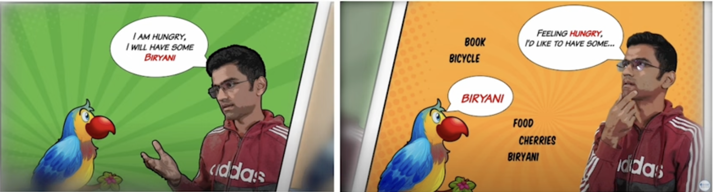

# LangChain Overview

## 1. Large Language Model (LLM)

### 1.1. Language Model

**Language Model** là một model xác suất mà có thể sinh ra từ ngữ dựa trên lượng dữ liệu mà nó được train. Nhưng thật ra, nó không hiểu ngôn ngữ đó.

Giả sử, ta có nuôi một con vẹt. Con vẹt này sẽ nghe ta nói câu “Tôi đói quá, tôi muốn ăn **bánh mì**” rất nhiều lần. Cho đến một ngày, ta chỉ cần nói “Tôi đói quá, tôi muốn ăn…”, con vẹt sẽ tự động trả lời là “bánh mì”.



Con vẹt chính là **Language Model**. Nó là một thứ được train rất nhiều để rồi khi ta đưa input là prompt (câu nói chưa hoàn thiện), LM sẽ cho ta output phù hợp với prompt đó. Dù con vẹt không hiểu ta đang nói gì, nhưng vì con vẹt nghe ta nói hàng ngày, nó sẽ có thể hoàn thiện câu nói của ta bằng từ có **xác suất cao nhất**.


LM sẽ đưa ra câu trả lời có xác suất xuất hiện lớn nhất trong dataset mà nó được train

### 1.2. Large Language Model (LLM)

**Large Language Model (LLM)** là một loại thuật toán mà sử dụng deep learning và được train bởi những data set rất lớn để hiểu, tóm tắt, sinh, dự đoán các thông tin.


LLM là một phần của DL

Con vẹt hàng ngày nó lớn dần, nó bay đi khắp nơi và nghe rất nhiều người nói. Sau một thời gian, những thông tin sẽ liên kết với nhau thành một mạng nơ-ron trong não nó nên nó có thể trả lời được những câu hỏi logic phức tạp hơn rất nhiều.

Nó không còn chỉ là hoàn thiện câu nói nữa mà nó có thể trả lời những câu hỏi phức tạp. Lúc này con vẹt giống như một **Large Language Model** - một thực thể đã được train bởi một lượng dữ liệu rất lớn. Lúc này, con vẹt thực sự đã hiểu những gì mà ta nói.


LLM có thể hiểu và trả lời được những câu hỏi phức tạp hơn

Các model được train bởi các dataset khác nhau sẽ đưa ra những output khác nhau.


Tại sao lại gọi là “**Large**” Languague Model?

1. **Có số lượng các parameter cực lớn** (mạng nơ-ron có nhiều layer, mối layer có nhiều unit; các parameters sẽ được sinh ra từ đường kết nối các unit với nhau)
   - GPT-3.5 có số lượng parameter là 1.3 tỉ (về sau tăng lên 175 tỉ)
   - GPT-4 có số lượng parameter là 1.76 nghìn tỉ
2. **Được train trên một lượng data set cực lớn**
   - GPT-3.5 được train bởi 45TB text data (Cần khoảng 75 nghìn năm để con người có thể đọc hết số thông tin đó)

Để train ChatGPT, ta cần khoảng 10.000 Nvidia GPUs

LLM có thể làm gì?

- Dịch ngôn ngữ
- Tổng hợp, tóm tắt văn bản
- Trả lời câu hỏi của người dùng
- Phân tích cảm xúc của một đoạn văn
- Sinh ra câu trả lời phù hợp với input, ngữ cảnh của người dùng

## 2. Transformer

### 2.1. Tại sao lại là Transformer?

Transformer là kiến trúc cốt lõi của các LLM. Cụ thể như nào thì sẽ không giải thích ở đây vì rất phức tạp 😢

Ta có thể dùng các kiến trúc khác như **Recurrent Neural Network (RNN)** để xử lý ngôn ngữ tự nhiên nhưng tại sao phải sử dụng **Transformer**?

- Với kiến trúc của mạng **RNN**, các từ sẽ được đưa vào mạng một cách **lần lượt**. Vì vậy, ta không thể train dữ liệu một cách song song. Hệ quả là việc train sẽ mất rất nhiều thời gian, không tận dụng được việc chạy song song của GPU và đối với những câu văn dài, những từ ở đầu câu sẽ mất liên hệ với những từ ở cuối.
  
- Với kiến trúc **Transformer**, ta có thể đưa **đồng thời** cả câu văn vào mạng để xử lý và lấy ra output là cả một câu thay vì phải đưa từng từ vào như RNN. Tuy nhiên, khi sử dụng Transformer, ta cần lưu ý 2 điều sau:
  - **Positional Encoding**: Đánh dấu xem từ nào vào trước, từ nào vào sau để bảo toàn ý nghĩa của câu
  - **Attention và Self-Attention**: Giúp các từ ngữ trong câu giữ được liên hệ với nhau về mặt logic (VD: Thơm và dứa,…)
  

### 2.2. Finetuning

Một LLM có thể xử lý nhiều loại các công việc và lĩnh vực khác nhau. Tuy nhiên, **finetuning** sẽ giúp model hiệu quả hơn.

**Finetuning** muốn nói đến việc ta lấy một pre-trained model và train nó dựa trên một tập dataset cụ thể hơn về một lĩnh vực nào đó (dataset này thường nhỏ hơn nhiều so với dataset của pre-trained model nhưng sẽ chuyên sâu về một lĩnh vực hơn)


## 3. LangChain

### 3.1. Giới thiệu

**LangChain** là một framework giúp ta phát triển các ứng dụng sử dụng LLM.

Nó cho phép ứng dụng:

- **Suy luận logic**: Tận dụng LLM để đưa ra câu trả lời logic
- **Nhận biết ngữ cảnh**: Giúp LLM biết được ngữ cảnh của câu hỏi để đưa ra câu trả lời phù hợp
- **Kết nối LLM với kiến thức bên ngoài**: Cung cấp thêm cho LLM embedding information (text, pdf, image,…) để có được câu trả lời tốt nhất

Framework này gồm nhiều phần phần:

- **LangChain Libraries**: Hỗ trợ cho Python và JavaScript. Nó cung cấp:
  - Các interface và tích hợp cho hàng loạt các components (text splitter, prompt template,…)
  - Một run time đơn giản để kết hợp những component này thành chains và agents
  - Những cài đặt có sẵn của chains và agents
- **[LangChain Templates](https://python.langchain.com/docs/templates)**: Một tập các kiến trúc tham chiếu mà dễ dàng triển khai cho nhiều loại nhiệm vụ khác nhau. (Python only)
- **[LangServe](https://python.langchain.com/docs/langserve)**: Một thư viện để triển khai các chain của LangChain dưới dạng một REST API. (Python only)
- **[LangSmith](https://smith.langchain.com/)**: Một nền tàng lập trình cho phép ta debug, test, đánh giá và giám sát chains mà được xây dựng trên bất kỳ LLM framework nào và tích hợp liền mạch với LangChain.


### 3.2. Luồng hoạt động của LangChain


- Chuẩn bị dữ liệu: Chuẩn bị những file pdf, website,… để ta chia nhỏ, trích xuất vector đặc trưng và đưa vào Vector DB
  - Vector DB có nhiều loại. Có thể dùng Faiss, ChromaDB,… Ta cần index cho DB này để dễ dàng tìm kiếm
- Khi người dùng nhập vào một Query, ta sử đưa query đó vào Prompt Template (Chain) và gửi nó qua một Embedding Model để trích xuất vector đặc trưng, đưa nó vào Query DB.
- Query DB sẽ so sánh với Vector DB để lấy ra những Related Document (thông tin liên quan) rồi gửi Related Document và Prompt tới LLM.
- LLM sẽ dựa vào đó để sình ra Response

### 3.3. Các component cơ bản trong LangChain

Một số component cơ bản của LangChain gồm:

- **Model**: Là LLM để sinh ra câu trả lời cho người dùng
- **Embedding model - Retrieval model**: LLM để
  - trích xuất đặc trưng (vector) của bối cảnh
  - trích xuất đặc trưng (vector) từ câu hỏi của người dùng
- **Chain**: Là một chuỗi các mắt xích, mỗi mắt xích sẽ làm một công việc cụ thể, rồi chuyển output của nó thành input cho mắt xích sau
- **Prompt template**: Giúp ta tạo ra prompt một cách dễ dàng, có thể truyền các tham số vào
- **Output parser**: Giúp ta định nghĩa ra format của output
- **Document loader**: Giúp ta đọc thông tin từ file, website,…
- **Vector - document**: Là những đặc trưng của một thông tin nào đó
- **Vectorstore - Vector DB**: Tập nhiều vector
- **Text splitter**: Giúp ta chia document thành nhiều phần nhỏ hơn (vì model có giới hạn kích thước của token truyền vào)
- **Retriever**: Xem xét đặc trưng của câu hỏi rồi lựa chọn những đặc trưng liên quan của bối cảnh để truyền cho Model.
- **Agent**: Là những công cụ giúp ta có thể quyết định xem có cần search thêm thông tin trên web hay không.

### 3.4. Thực hành với LLM Chain

Cài đặt:

```bash
npm install @langchain/openai
```

Biến môi trường:

```bash
OPENAI_API_KEY="..."
```

Đây là ví dụ sử dụng LangChain với input là một message đơn giản.

```jsx
import { ChatOpenAI } from "@langchain/openai";

const chatModel = new ChatOpenAI({
  model: "gpt-3.5-turbo",
  apiKey: process.env.OPENAI_API_KEY,
});

const data = await chatModel.invoke("what is LangSmith?");
console.log(data);
```

```json
AIMessage {
  content: 'LangSmith refers to the combination of two surnames, Lang and Smith. It is most commonly used as a fictional or hypothetical name for a person or a company. This term may also refer to specific individuals or entities named LangSmith in certain contexts.',
  additional_kwargs: { function_call: undefined, tool_calls: undefined }
}
```

**Nhận xét**: Kết quả của ví dụ này không liên quan để điều mà ta muốn hỏi. Nguyên nhân là nó không hiểu được bối cảnh kỹ thuật của ta

Sử dụng LangChain với **prompt template**. **Prompt template** sẽ chuyển đổi input của user thành một input khác tốt hơn dành cho LLM.

Với prompt template, ta có thể cung cấp **bối cảnh** cho chatModel, từ đó giúp ta có được response phù hợp hơn.

```jsx
import { ChatOpenAI } from "@langchain/openai";
import { ChatPromptTemplate } from "@langchain/core/prompts";

const chatModel = new ChatOpenAI({
  model: "gpt-3.5-turbo",
  apiKey: process.env.OPENAI_API_KEY,
});

const prompt = ChatPromptTemplate.fromMessages([
  ["system", "You are a world class technical documentation writer."],
  ["user", "{input}"],
]);

const chain = prompt.pipe(chatModel);

const data = await chain.invoke({
  input: "what is LangSmith?",
});
console.log(data);
```

```json
AIMessage {
  content: 'LangSmith is a powerful programming language created for high-performance software development. It is designed to be efficient, intuitive, and capable of handling complex computations and data manipulations. With its extensive set of features and libraries, LangSmith provides developers with the tools necessary to build robust and scalable applications.\n' +
    '\n' +
    'Some key features of LangSmith include:\n' +
    '\n' +
    '1. Strong typing: LangSmith enforces type safety, preventing common programming errors and ensuring code reliability.\n' +
    '\n' +
    '2. Advanced memory management: The language provides built-in memory management mechanisms, such as automatic garbage collection, to optimize memory usage and reduce the risk of memory leaks.\n' +
    ... +
    'Overall, LangSmith aims to provide a robust and efficient development environment for creating software applications across various domains, from scientific simulations to web development and beyond.',
  additional_kwargs: { function_call: undefined, tool_calls: undefined }
}
```

**Nhận xét**: Kết quả của ví dụ này dù vẫn không chính xác nhưng nó đang mang tính kỹ thuật hơn so với response trước.

Output của ChatModel đang là một message object. Nhưng sẽ dễ dàng hơn nếu như ta làm việc với string. Ta sẽ thêm một **output parser** đơn giản để convert message thành một string.

```jsx
import { ChatOpenAI } from "@langchain/openai";
import { ChatPromptTemplate } from "@langchain/core/prompts";
import { StringOutputParser } from "@langchain/core/output_parsers";

const outputParser = new StringOutputParser();

const chatModel = new ChatOpenAI({
  model: "gpt-3.5-turbo",
  apiKey: process.env.OPENAI_API_KEY,
});

const prompt = ChatPromptTemplate.fromMessages([
  ["system", "You are a world class technical documentation writer."],
  ["user", "{input}"],
]);

const llmChain = prompt.pipe(chatModel).pipe(outputParser);

const data = await llmChain.invoke({
  input: "what is LangSmith?",
});

console.log(data);
```

```json
LangSmith is a sophisticated online language translation tool. It leverages artificial intelligence and machine learning algorithms to provide accurate and efficient translation services across multiple languages. Whether it's translating documents, websites, or text snippets, LangSmith offers a seamless, user-friendly experience while maintaining the integrity and nuances of the original content. Its advanced features include context-aware translations, language customization options, and quality assurance checks, making it an invaluable tool for businesses, individuals, and language professionals alike.
```

### 3.5. Thực hành với retrieval chain

Để câu trả lời của câu hỏi "what is LangSmith?” được chính xác, ta cần cung cấp thêm bối cảnh cho LLM. Ta có thể sử dụng **retrieval** để làm việc này. Retrieval cho phép ta truyền nhiều dữ liệu vào LLM một cách trực tiếp. Sau đó, ta có thể sử dụng **retriever** để chỉ fetch những phần dữ liệu phù hợp nhất.

Ta sẽ cố gắng lấy dữ dữ liệu phù hợp bằng Retriever và truyền nó vào prompt. Retriever có thể được hỗ trợ bởi SQL table, internet,… nhưng trong trường hợp này, ta sẽ populate một vector store và dùng nó như một retriever. For more information on vectorstores, see [this documentation](https://js.langchain.com/docs/modules/data_connection/vectorstores).

Đầu tiên, ta cần **load dữ liệu mà ta muốn index**. Ta sẽ sử dụng một [**document loader**](https://js.langchain.com/docs/integrations/document_loaders/web_loaders/web_cheerio) dựa trên **Cheerio** (thư viện để cào dữ liệu) để lấy dữ liệu từ webpage.

Cài đặt thư viện:

```bash
npm install cheerio
```

Code như sau:

```jsx
import { CheerioWebBaseLoader } from "langchain/document_loaders/web/cheerio";

const loader = new CheerioWebBaseLoader(
  "https://docs.smith.langchain.com/user_guide"
);

const docs = await loader.load();

console.log(docs.length);
console.log(docs[0].pageContent.length);
```

```jsx
1;
36542;
```

Lưu ý rằng kích thước của loaded document (dữ liệu được cào xuống) là rất lớn và có thể vượt quá giới hạn của lượng dữ liệu mà ta có thể truyền vào một model call. Vì vậy, ta cần **chia document thành nhiều chunk** có thể quản lý được. Ta có thể sử dụng [text splitter](https://js.langchain.com/docs/modules/data_connection/document_transformers/):

```jsx
import { CheerioWebBaseLoader } from "langchain/document_loaders/web/cheerio";
import { RecursiveCharacterTextSplitter } from "langchain/text_splitter";

const splitter = new RecursiveCharacterTextSplitter();

const loader = new CheerioWebBaseLoader(
  "https://docs.smith.langchain.com/user_guide"
);

const docs = await loader.load();

const splitDocs = await splitter.splitDocuments(docs);

console.log(splitDocs.length);
console.log(splitDocs[0].pageContent.length);
```

```jsx
49;
441;
```

Tiếp theo, ta cần index dữ liệu được cào xuống vào một vector store. Để làm được việc này, ta cần thêm một vài component, đó là [**embedding model**](https://js.langchain.com/docs/modules/data_connection/text_embedding) và [**vectorstore**](https://js.langchain.com/docs/modules/data_connection/vectorstores).

```jsx
import { OpenAIEmbeddings } from "@langchain/openai";

const embeddings = new OpenAIEmbeddings();
```

Giờ ta có thể dùng embedding model này để nhập dữ liệu từ document (dữ liệu crawl được) vào vectorstore. Ta sẽ sử dụng [simple in-memory demo vectorstore](https://js.langchain.com/docs/integrations/vectorstores/memory) để làm ví dụ:

```jsx
import { MemoryVectorStore } from "langchain/vectorstores/memory";

const vectorstore = await MemoryVectorStore.fromDocuments(
  splitDocs,
  embeddings
);
```

LangChain vectorstore class sẽ tự động tạo ra các raw document (index) bằng embeddings model.

Khi ta đã có các indexed data trong vectorstore, ta sẽ tạo ra một retrieval chain. Chain này sẽ nhận input là một câu hỏi từ người dùng, tìm kiếm các document liên quan trong vectorstore, sau đó truyền câu hỏi và document liên quan này tới LLM để nó trả lời câu hỏi.

Đầu tiên, ta cài đặt một chain nhận input là [câu hỏi, retrieved documents] rồi sinh ra câu trả lời

```jsx
import { createStuffDocumentsChain } from "langchain/chains/combine_documents";
import { ChatPromptTemplate } from "@langchain/core/prompts";

const prompt =
  ChatPromptTemplate.fromTemplate(`Answer the following question based only on the provided context:

<context>
{context}
</context>

Question: {input}`);

const documentChain = await createStuffDocumentsChain({
  llm: chatModel,
  prompt,
});
```

Ta có thể chạy nó bằng cách truyền trực tiếp **câu hỏi** và **document** (đóng vai trò như bối cảnh) vào `documentChain.invoke`:

```jsx
import { Document } from "@langchain/core/documents";

await documentChain.invoke({
  input: "what is LangSmith?",
  context: [
    new Document({
      pageContent:
        "LangSmith is a platform for building production-grade LLM applications.",
    }),
  ],
});
```

```jsx
 LangSmith is a platform for building production-grade Large Language Model (LLM) applications.
```

Tuy nhiên, ta muốn các document đi qua Retriever mà ta vừa cài đặt trước vì Retriever sẽ lựa chọn các document phù hợp nhất để cho vào chain thay vì cho tất cả document vào chain.

```jsx
import { createRetrievalChain } from "langchain/chains/retrieval";

const retriever = vectorstore.asRetriever();

const retrievalChain = await createRetrievalChain({
  combineDocsChain: documentChain,
  retriever,
});

const result = await retrievalChain.invoke({
  input: "what is LangSmith?",
});

console.log(result.answer);
```

```jsx
LangSmith is a tool developed by LangChain that is used for debugging and monitoring LLMs, chains, and agents in order to improve their performance and reliability for use in production.
```

Full source code
  ```jsx
  import { CheerioWebBaseLoader } from "langchain/document_loaders/web/cheerio";
  import { RecursiveCharacterTextSplitter } from "langchain/text_splitter";
  import { OpenAIEmbeddings } from "@langchain/openai";
  import { MemoryVectorStore } from "langchain/vectorstores/memory";
  import { createStuffDocumentsChain } from "langchain/chains/combine_documents";
  import { ChatPromptTemplate } from "@langchain/core/prompts";
  import { createRetrievalChain } from "langchain/chains/retrieval";
  import { ChatOpenAI } from "@langchain/openai";

  const loader = new CheerioWebBaseLoader(
    "https://docs.smith.langchain.com/user_guide"
  );
  const splitter = new RecursiveCharacterTextSplitter();
  const embeddings = new OpenAIEmbeddings();
  const chatModel = new ChatOpenAI({});

  const docs = await loader.load();
  const splitDocs = await splitter.splitDocuments(docs);
  const vectorstore = await MemoryVectorStore.fromDocuments(
    splitDocs,
    embeddings
  );

  const prompt =
    ChatPromptTemplate.fromTemplate(`Answer the following question based only on the provided context:
  
  <context>
  {context}
  </context>
  
  Question: {input}`);

  const documentChain = await createStuffDocumentsChain({
    llm: chatModel,
    prompt,
  });

  const retriever = vectorstore.asRetriever();
  const retrievalChain = await createRetrievalChain({
    combineDocsChain: documentChain,
    retriever,
  });

  const result = await retrievalChain.invoke({
    input: "what is LangSmith?",
  });

  console.log(result.answer);
  ```

### 3.6. Conversational retrieval chain

Những gì ta làm ở trên chỉ giúp ta trả lời một câu hỏi duy nhất. Ở phần này, ta sẽ tạo ra **chain mà có thể trả lời nhiều câu hỏi liên tiếp**.

Khi sử dụng hàm `createRetrievalChain`, ta cần thay đổi 2 thứ:

1. Retriever không chỉ dựa vào input gần nhất mà cần dựa vào cả cuộc trò chuyện
   - Retriever của ta đang chỉ đưa những document **liên quan tới input gần nhất** vào chain
   - Ta muốn đưa những document **liên quan tới cả cuộc trò chuyện**
   - Vì vậy, ta cần LLM sinh ra cho ta một search query. Serach query sẽ giúp ta có được một retriever mới mà có thể lọc những document liên quan tới cả cuộc trò chuyện.
2. The final LLM chain cũng cần quan tâm tới cả cuộc trò chyện
   - LLM của ta chỉ xem xét bối cảnh và **input gần nhất** để đưa ra câu trả lời
   - Ta muốn LLM xem xét bối cảnh và **cả cuộc trò truyện** để đưa ra câu trả lời

```jsx
import { CheerioWebBaseLoader } from "langchain/document_loaders/web/cheerio";
import { RecursiveCharacterTextSplitter } from "langchain/text_splitter";
import { OpenAIEmbeddings } from "@langchain/openai";
import { MemoryVectorStore } from "langchain/vectorstores/memory";
import { createStuffDocumentsChain } from "langchain/chains/combine_documents";
import { ChatPromptTemplate } from "@langchain/core/prompts";
import { createRetrievalChain } from "langchain/chains/retrieval";
import { ChatOpenAI } from "@langchain/openai";
import { createHistoryAwareRetriever } from "langchain/chains/history_aware_retriever";
import { MessagesPlaceholder } from "@langchain/core/prompts";
import { HumanMessage, AIMessage } from "@langchain/core/messages";

const loader = new CheerioWebBaseLoader(
  "https://docs.smith.langchain.com/user_guide"
);
const splitter = new RecursiveCharacterTextSplitter();
const embeddings = new OpenAIEmbeddings();
const chatModel = new ChatOpenAI({});

const docs = await loader.load();
const splitDocs = await splitter.splitDocuments(docs);
const vectorstore = await MemoryVectorStore.fromDocuments(
  splitDocs,
  embeddings
);
const retriever = vectorstore.asRetriever();

const historyAwarePrompt = ChatPromptTemplate.fromMessages([
  new MessagesPlaceholder("chat_history"),
  ["user", "{input}"],
  [
    "user",
    "Given the above conversation, generate a search query to look up in order to get information relevant to the conversation",
  ],
]);

const historyAwareRetrieverChain = await createHistoryAwareRetriever({
  llm: chatModel,
  retriever,
  rephrasePrompt: historyAwarePrompt,
});

const historyAwareRetrievalPrompt = ChatPromptTemplate.fromMessages([
  [
    "system",
    "Answer the user's questions based on the below context:\n\n{context}",
  ],
  new MessagesPlaceholder("chat_history"),
  ["user", "{input}"],
]);

const historyAwareCombineDocsChain = await createStuffDocumentsChain({
  llm: chatModel,
  prompt: historyAwareRetrievalPrompt,
});

const conversationalRetrievalChain = await createRetrievalChain({
  retriever: historyAwareRetrieverChain,
  combineDocsChain: historyAwareCombineDocsChain,
});

const result2 = await conversationalRetrievalChain.invoke({
  chat_history: [
    new HumanMessage("Can LangSmith help test my LLM applications?"),
    new AIMessage("Yes!"),
  ],
  input: "tell me how",
});

console.log(result2.answer);
```

### 3.7. PDF loader chain

```jsx
import { PDFLoader } from "langchain/document_loaders/fs/pdf";
import { RecursiveCharacterTextSplitter } from "langchain/text_splitter";
import { MemoryVectorStore } from "langchain/vectorstores/memory";
import { OpenAIEmbeddings } from "@langchain/openai";
import { ChatPromptTemplate } from "@langchain/core/prompts";
import { ChatOpenAI } from "@langchain/openai";
import { createStuffDocumentsChain } from "langchain/chains/combine_documents";
import { createRetrievalChain } from "langchain/chains/retrieval";
import { StructuredOutputParser } from "langchain/output_parsers";

const splitter = new RecursiveCharacterTextSplitter();
const loader = new PDFLoader("public/pdf/invoice.pdf");
const embeddings = new OpenAIEmbeddings();
const chatModel = new ChatOpenAI({});

const docs = await loader.load();
const splitDocs = await splitter.splitDocuments(docs);
const vectorstore = await MemoryVectorStore.fromDocuments(
  splitDocs,
  embeddings
);

const parser = StructuredOutputParser.fromNamesAndDescriptions({
  total: "total amount of money in the invoice",
  tax: "total tax amount in the invoice",
});

const prompt =
  ChatPromptTemplate.fromTemplate(`Answer the following question based only on the provided context:

<context>
{context}
</context>

Generate the response based on this structured output:
{format_instructions}

Question: {input}`);

const documentChain = await createStuffDocumentsChain({
  llm: chatModel,
  prompt,
  outputParser: parser,
});

const retriever = vectorstore.asRetriever();
const retrievalChain = await createRetrievalChain({
  combineDocsChain: documentChain,
  retriever,
});

const result = await retrievalChain.invoke({
  input: "what is the total money of this invoice?",
  format_instructions: parser.getFormatInstructions(),
});

console.log(result.answer);
```
