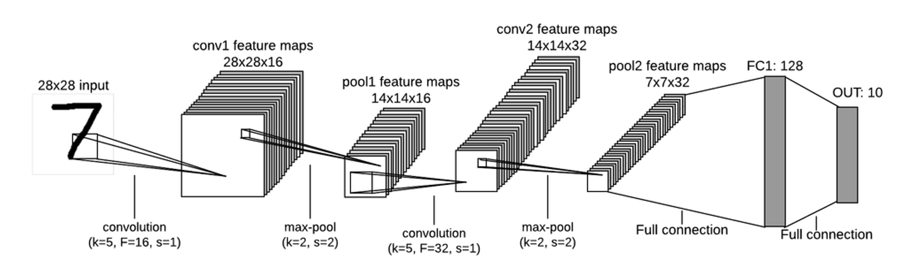
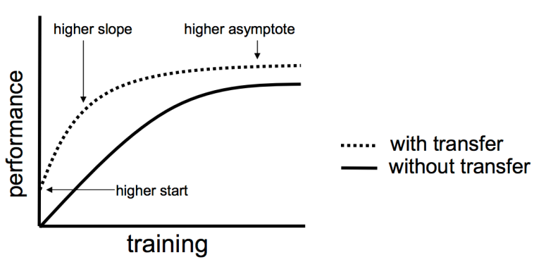

# LLM 모델 미세 조정

## 1. 전이 학습

**전이 학습(Transfer learning)**은 모델이 다른 사전 훈련된 모델의 지식을 활용하여 모델의 효율성을 높이는 과정입니다.

CNN에서 알다시피:

- 합성곱 레이어는 이미지의 특징을 추출하는 역할을 합니다. 각 레이어를 통과하면서 모델은 다양한 세부 사항을 학습합니다. (점 → 직선 → 코, 귀 등 → 얼굴)
- 그 다음 완전 연결 레이어로 들어가 데이터의 차원을 줄이는 등의 작업을 수행합니다.

따라서 우리는 사전 훈련된 모델의 합성곱 네트워크 부분(합성곱 레이어와 풀링 레이어)을 우리의 문제에 사용할 수 있습니다. 이 과정을 **전이 학습**이라고 합니다.

위의 그래프를 통해 전이 학습의 3가지 장점을 볼 수 있습니다:

- 초기 성능이 더 좋습니다
- 성능 향상 속도가 더 빠릅니다
- 최적의 정확도의 점근선이 더 높습니다(higher asymptote)

전이 학습에는 두 가지 유형이 있습니다:

- **특징 추출기(Feature Extractor)**: 사전 훈련된 모델의 ConvNet은 이미지 특징(귀의 모양, 코의 형태 등)을 출력으로 합니다. 이제 이러한 특징들이 선형 분류기(선형 SVM, 소프트맥스 분류기 등) 또는 선형/로지스틱 회귀를 사용한 이미지 분류 문제의 입력이 됩니다.
  - 간단히 말해, ConvNet을 출력 레이어와 연결하는 것입니다. 여기서 출력 레이어의 활성화 함수는 소프트맥스, 로지스틱 등이 될 수 있습니다.
- **미세 조정(Fine tuning)**: 사전 훈련된 모델의 ConvNet을 사용하여 이미지 특징을 추출한 후, 이를 새로운 CNN의 입력으로 간주하고 새로운 ConvNet과 완전 연결 레이어를 추가합니다. VGGFace 2 모델의 ConvNet은 일반적인 얼굴 속성을 추출할 수 있지만, 베트남 사람들은 다른 특성을 가지고 있어 베트남 사람들의 특성을 추가로 학습하기 위해 새로운 ConvNet을 추가해야 합니다.
  - 간단히 말해, ConvNet을 우리만의 다른 ConvNet과 연결하여 특정 특징을 학습하는 것입니다.

### 1.1. 특징 추출기 (Feature Extractor)

CNN에서 ConvNet 부분만 유지하고 FC(Fully Connected) 레이어를 제거합니다. 그런 다음 남은 ConvNet의 출력을 **다중 출력 로지스틱 회귀 모델**의 입력으로 사용합니다.

왼쪽은 VGG16 모델, 오른쪽은 ConvNet만 포함한 VGG16 모델 (Fully Connected 레이어 제거)

**다중 출력 로지스틱 회귀 모델**은 두 가지 형태가 있습니다:

1. **첫 번째 형태**는 은닉층이 없는 신경망으로, 출력층의 활성화 함수는 [소프트맥스 함수](https://nttuan8.com/bai-7-gioi-thieu-keras-va-bai-toan-phan-loai-anh/#Xay_dung_model)이고, 손실 함수는 [범주형 교차 엔트로피](https://nttuan8.com/bai-7-gioi-thieu-keras-va-bai-toan-phan-loai-anh/#Loss_function)입니다. [이미지 분류](https://nttuan8.com/bai-7-gioi-thieu-keras-va-bai-toan-phan-loai-anh/) 문제와 유사합니다.

   

2. **두 번째 형태**는 로지스틱 회귀와 유사하며, 모델이 2개의 클래스만 분류합니다. 매번 1개의 클래스와 나머지 모든 클래스를 분류합니다.

   

### 1.2. 미세 조정 (Fine tuning)

CNN에서 ConvNet 부분만 유지하고 FC 레이어를 제거합니다. 그런 다음 ConvNet의 출력에 새로운 Fully Connected 레이어를 추가합니다.

모델 훈련 시 두 단계로 나눕니다:

**1단계**: 새로 추가한 완전 연결 레이어의 계수는 무작위로 초기화되지만, 사전 훈련된 모델의 ConvNet 레이어는 이미 ImageNet 데이터셋으로 훈련되었으므로 VGG16 모델의 ConvNet 레이어는 훈련하지 않습니다 (동결/freeze). 약 20-30 에폭 후 새 레이어의 계수가 데이터로부터 학습되면 2단계로 넘어갑니다.

(에폭에 대해 자세히 알아보려면 [**초보자를 위한 딥러닝 속성 과정**](https://www.notion.so/Deep-Learning-Crash-Course-for-Beginners-8c01dd2ad1834f7491025125d5085efe?pvs=21)을 참조하세요.)

**2단계**: 사전 훈련된 모델의 ConvNet 레이어의 동결을 해제하고, 사전 훈련된 모델의 ConvNet 레이어와 새 레이어를 함께 훈련합니다. 시간과 GPU 상황에 따라 VGG16의 ConvNet에서 모든 레이어를 동결 해제하거나 마지막 몇 개의 레이어만 동결 해제할 수 있습니다.

<aside>
💡 **의견**

미세 조정의 정확도가 특징 추출기보다 좋지만, 미세 조정의 훈련 시간이 훨씬 더 깁니다.

간단히 설명하면, 특징 추출기는 ImageNet 데이터셋의 사전 훈련된 모델에서 일반적인 특징만 추출하므로 그다지 정확하지 않습니다.

그러나 미세 조정에서는 새로운 레이어를 추가하고 VGG16의 ConvNet에서 일부 레이어를 다시 훈련시키므로, 모델이 우리 데이터의 속성과 특징을 학습하여 정확도가 더 높아집니다.

</aside>

### 1.3. 전이 학습을 언제 사용해야 할까요?

전이 학습을 사용할 때 가장 중요한 두 가지 요소는 다음과 같습니다:

- 보유한 데이터의 크기
- 훈련해야 할 모델과 사전 훈련된 모델 간의 데이터 유사성

고려해야 할 상황들:

- **작은 데이터셋이며 사전 훈련된 모델의 데이터와 유사함 → 특징 추출기:** 데이터가 작아서 미세 조정을 사용하면 모델이 과적합될 수 있습니다. 또한 데이터가 유사하므로 사전 훈련된 모델의 ConvNet이 우리 데이터의 특징도 추출할 수 있습니다. 따라서 특징 추출기를 사용해야 합니다.
- **큰 데이터셋이며 사전 훈련된 모델의 데이터와 유사함 → 미세 조정:** 데이터가 많아서 과적합을 걱정하지 않아도 되므로 미세 조정을 사용해야 합니다.
- **작은 데이터셋이지만 사전 훈련된 모델의 데이터와 다름:** 데이터가 작아서 과적합을 피하기 위해 특징 추출기를 사용해야 합니다. 그러나 데이터가 다르므로 사전 훈련된 모델의 전체 ConvNet을 사용하지 말고 초기 레이어만 사용해야 합니다. 초기 레이어는 더 일반적인 특징(모서리, 각도 등)을 학습하고, 후기 레이어는 데이터셋의 더 구체적인 특징(예: 눈, 코 등)을 학습하기 때문입니다.
- **큰 데이터셋이며 사전 훈련된 모델의 데이터와 다름:** 모델을 처음부터 훈련할 수 있지만, 사전 훈련된 모델의 가중치 값으로 모델의 가중치를 초기화한 후 정상적으로 훈련하는 것이 더 좋습니다.

**주의사항**

- 사전 훈련된 모델은 고정된 이미지 크기로 훈련되었으므로, 사전 훈련된 모델을 사용할 때 이미지 크기를 사전 훈련된 모델의 ConvNet이 요구하는 크기로 조정해야 합니다.
- 사전 훈련된 모델의 ConvNet의 학습률은 작은 값으로 설정해야 합니다. 이미 사전 훈련된 모델에서 학습되었으므로 새로 추가된 레이어보다 업데이트가 덜 필요하기 때문입니다.

## 2. 데이터 증강

전이 학습 외에도 모델 훈련을 위한 데이터 부족 문제를 해결하는 또 다른 기술로 데이터 증강이 있습니다. 증강은 기존 데이터로부터 훈련 데이터를 생성하는 기술입니다. 이미지에 대한 일반적인 증강 기술을 살펴보겠습니다.

**뒤집기(Flip)**: 이미지를 수직 또는 수평으로 뒤집기

**회전(Rotation)**: 이미지를 다양한 각도로 회전

**크기 조정(Scale)**: 이미지 확대 또는 축소

**자르기(Crop)**: 이미지의 일부를 잘라내고 원래 이미지 크기로 다시 조정

**이동(Translation)**: x, y 방향으로 이미지 이동

그러나 회전이나 이동 시 실제 이미지에는 없는 검은 영역이 생깁니다. 이를 처리하는 방법으로는 새 이미지의 가장자리 값을 사용하여 검은 픽셀을 채우거나, 가장자리를 기준으로 대칭된 이미지의 값으로 검은 값을 할당하는 등의 방법이 있습니다.

어떤 증강 기법을 적용할지는 해결하려는 문제에서 이미지의 의미에 따라 달라집니다.
