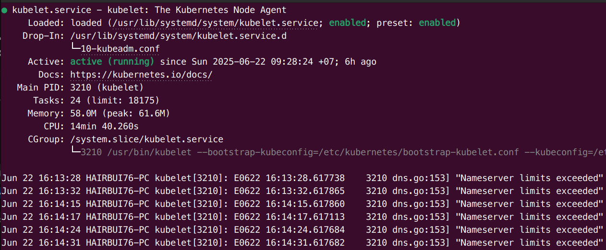
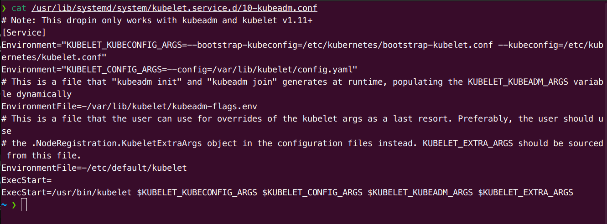
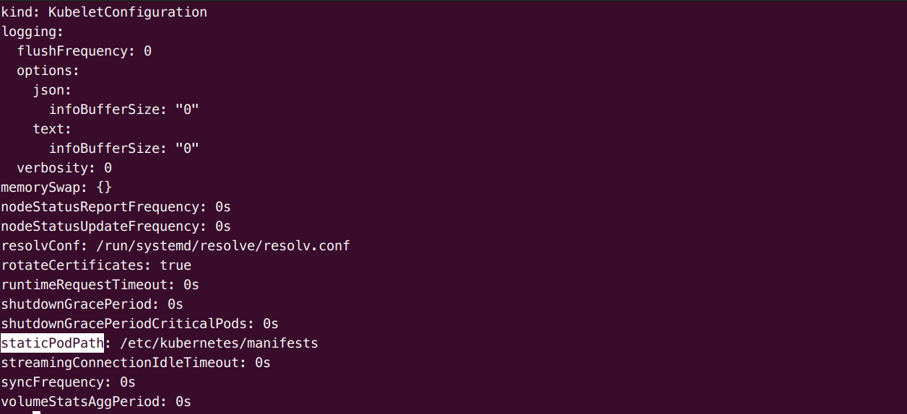

# Logging and Troubleshooting

## Overview

> Kubernetes relies on API calls and is sensitive to network issues. Standard Linux tools and processes are the best method for troubleshooting your cluster. If a shell, such as bash, is not available in an affected Pod, consider deploying another similar pod with a shell, like busybox. DNS configuration files and tools like **dig** are a good place to start. For more difficult challenges, you may need to install other tools, like **tcpdump**.

## Ephemeral Containers

> A feature new to the 1.16 version is the ability to add a container to a running pod. This would allow a feature-filled container to be added to an existing pod without having to terminate and re-create. Intermittent and difficult to determine problems may take a while to reproduce, or not exist with the addition of another container.
> These containers are added via the **ephemeralcontainers** handler via an API call, not via the **podSpec**. As a result, the use of **kubectl  edit** is not possible.

You may be able to use the **kubectl attach** command to join an existing process within the container. This can be helpful instead of **kubectl exec**, which executes a new process. The functionality of the attached process depends entirely on what you are attaching to.

```bash
kubectl debug buggypod --image debian --attach
```

## Cluster Start Sequence

The cluster startup sequence begins with systemd if you built the cluster using **kubeadm**. Other tools may leverage a different method. Use `systemctl status kubelet.service` to see the current state and configuration files used to run the kubelet binary.



As you can see in status of kubelet, the configuration file location is `/usr/lib/systemd/system/kubelet.service.d/10-kubeadm.conf`



Then, check the file `/var/lib/kubelet/config.yaml`



* **staticPodPath** is set to `/etc/kubernetes/manifests/`
* The 4 default yaml files will start the base pods necessary to run the cluster:

> kubelet creates all pods from *.yaml in directory: kube-apiserver, etcd, kube-controller-manager, kube-scheduler.
> Once the watch loops and controllers from kube-controller-manager run using etcd data, the rest of the configured objects will be created.

## Using krew

> krew is a plugin manager for kubectl

As a plugin the declaration of options such as namespace or container to use must come after the command. For example:

```bash
kubectl sniff bigpod-abcd-123 -c mainapp -n accounting
```
