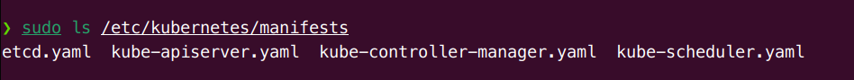

# Kubernetes Architecture

## Main Components


Kubernetes has the following main components:

- Control plane(s) and worker node(s)
- Operators
- Services
- Pods of containers
- Namespaces and quotas
- Network and policies
- Storage

> **IMPORTANT**: When upgrading a cluster, be aware that each of these components are developed to work together by multiple teams. Care should be taken to ensure a proper match of versions. The `kubeadm upgrade plan` command is useful to discover this information.

## Control Plane Node

The Kubernetes cp runs various server and manager processes for the cluster.

> When building a cluster using `kubeadm`, the kubelet process is managed by systemd. Once running, it will start every pod found in `/etc/kubernetes/manifests` directory.



- **kube-apiserver**: The **kube-apiserver** is central to the operation of the Kubernetes cluster. All calls, both internal and external traffic, are handled via this agent. All actions are accepted and validated by this agent, and it is the only connection to the **etcd** database.
- **kube-scheduler**: The **kube-scheduler** uses an algorithm to determine which node will host a Pod of containers. The scheduler will try to view available resources (such as volumes) to bind, and then try and retry to deploy the Pod based on availability and success.
- **etcd**: The state of the cluster, networking, and other persistent information is kept in an etcd database, or, more accurately, a b+tree key-value store. Rather than finding and changing an entry, values are always appended to the end. Simultaneous requests to update a value all travel via the kube-apiserver, which then passes along the request to etcd in a series.
- **kube-controller-manager**: The kube-controller-manager is a core control loop daemon which interacts with the **kube-apiserver** to determine the state of the cluster. If the state does not match, the manager will contact the necessary controller to match the desired state.

## Worker Nodes

- All nodes run the kubelet and kube-proxy, as well as the container engine, such as `containerd` or `cri-o`

- The `kube-proxy` is in charge of managing the network connectivity to the containers. By using `iptables`, it can monitors Services and Endpoints using a random port to proxy traffic via `ipvs`

- Each node could run in a different engine. It is likely that Kubernetes will support additional container runtime engines.

### Kubelet

The kubelet systemd process is the heavy lifter for changes and configuration on worker nodes. It accepts the API calls for Pod specifications (PodSpec is a JSON or YAML file that describes a pod).

> Should a Pod require access to storage, Secrets or ConfigMaps, the kubelet will ensure access or creation. It also sends back status to the kube-apiserver for eventual persistence.

* Uses PodSpec
* Mounts volumes to Pod
* Downloads secrets
* Passes request to local container engine
* Reports status of Pods and node to cluster

### Operators

A simplified view of an operator is an agent, or Informer, and a downstream store. Using a DeltaFIFO queue, the source and downstream are compared. A loop process receives an **obj** or object, which is an array of deltas from FIFO queue.

> As long as the delta is not of the type **Deleted**, the logic of the operator is used to create or modify some object until it matches the specification.

#### Informer

> The *Informer* which uses the API server as a source requests the state of an object via an API call. The data is cached to minimize the API server transactions. A similar agent is the *SharedInformer*, objects are often used by multiple other objects. It creates a shared cache of the state for multiple requests.

#### Workqueue

> A *Workqueue* uses a key to handout tasks to various workers. The standard Go work queues of rate limiting, delayed, and time queue are typically used.

#### Others

> The endpoints, namespace and serviceaccounts operators each manage the eponymous resources for Pods.

## Service Operator

> With every object and agent decoupled we need a flexible and scalable agent which connects resources together and will reconnect, should something die and a replacement is spawned. A *service* is an operator which listens to the *endpoint* operator to provide a persistent IP addresses chosen from a pool.

Then, the *service* operator sends messages via the kube-apiserver which forwards settings to kube-proxy on every node.

A *service* also handles access policies for inbound requests, useful for resource control, as well as for security.

* Connect Pods together
* Expose Pods to Internet
* Decouple settings
* Define Pod access policy

## Pods

A *Pod* is a group of containers running on a node. It is the smallest unit of deployment in Kubernetes. Due to shared resources, the design of a Pod typically follows a one-process-per-container architecture.

### Containers

Containers in a Pod are started in parallel => There is no way to determine which container will become available first inside a pod. The use of `InitContainers` can order startup, to some extent. To support a single process running in a container, you will need logging, proxy, or special adapter.

There is only one IP address perPod, for almost every network plugin. If there is more than one container in a pod, they must share the IP. To communicate with each other, they can either use IPC, the loopback interface, or a shared filesystem.

In the resources section of the PodSpec, you can pass parameters to the container runtime on the scheduled node:

```yaml
resources:
  limits:
    memory: "128Mi"
    cpu: "256m"
  requests:
    memory: "64Mi"
    cpu: "128m"
```

> Another way to manage resource usage of the containers is by creating a `ResourceQuota` object, which limits the total amount of resources that can be used by a namespace.

```yaml
apiVersion: v1
kind: ResourceQuota
metadata:
  name: compute-resources
spec:
  hard:
    requests.cpu: "1"
    requests.memory: 1Gi
    limits.cpu: "2"
    limits.memory: 2Gi
  scopeSelector:
    matchExpressions:
      - operator: In
        scopeName: BestEffort
```

> The `scopeSelector` field in the quota spec is used to run a pod at a specific priority if it has the appropriate `priorityClassName` in its pod spec.

#### Init Containers

Standard containers are sent to the container engine at the same time, and may start in any order. `LivenessProbe`, `ReadinessProbe` and `StatefulSets` can be used to determine the order, but can add complexity. Should the init container fail, it will be restarted until completion, without the app container running.

The code below will run the init container until the `ls` command succeeds; then the database container will start.

```yaml
apiVersion: v1
kind: Pod
metadata:
  name: my-pod
spec:
  initContainers:
    - name: init-container
      image: busybox
      command: ["sh", "-c", "ls /data && sleep 3600"]
  containers:
    - name: database
      image: mysql
      ports:
        - containerPort: 3306
```

## Component Review


**IMPORTANT**: Note that all of the components are communicating with **kube-apiserver**. Only **kube-apiserver** communicates with the **etcd** database.

## Node

A node is an API object created outside the cluster representing an instance. While a cp must be Linux, worker nodes can also be Linux, Windows, or other OSes.

If the kube-apiserver cannot communicate with the kubelet on a node for 5 minutes, the default `NodeLease` will schedule the node for deletion and the NodeStatus wil change from `Ready`. The pods will be evicted once a connection is re-established. They are no longer forcibly removed and rescheduled by the cluster.

Each node object exists in the `kube-node-lease` namespace.

## Single IP per Pod

A pod represents a group of co-located containers with some associated data volumes. All containers in a Pod share the same network namespace.


The graphic shows a pod with two containers, A and B, and two data volumes, 1 and 2. Containers A and B share the network namespace of a third container, known as the pause container. The pause container is used to get an IP address, then all the containers in the pod will use its network namespace.

To communicate with each other, containers within pods can use the loopback interface, write to files on a common filesystem, or via inter-process communication (IPC). There is now a network plugin from HPE Labs which allows multiple IP addresses per pod, but this feature has not grown past this new plugin.

## Container to Outside Path

This graphic shows a node with a single, dual-container pod. A NodePort service connects the Pod to the outside network.


Even though there are two containers, they share the same namespace and the same IP address, which would be configured by kubectl working with **kube-proxy**. The IP address is assigned before the containers are started, and will be inserted into the containers. The container will have an interface like **eth0@tun10**. This IP is set for the life of the pod.

The endpoint is created at the same time as the service. Note that it uses the pod IP address, but also includes a port. The service connects network traffic from a node high-number port to the endpoint using `iptables` with `ipvs` on the way. The **kube-controller-manager** handles the watch loops to monitor the need for endpoints and services, as well as any updates or deletions.

## Services

We can use a *service* to connect one pod to another, or to outside of the cluster


This graphic shows a pod with a primary container, App, with an optional sidecar Logger. Also seen is the pause container, which is used by the cluster to reserve the IP address in the namespace prior to starting the other pods. This container is not seen from within Kubernetes, but can be seen using **docker** and **crictl**.

This graphic also shows a ClusterIP which is used to connect inside the cluster, not the IP of the cluster. As the graphic shows, this can be used to connect to a NodePort for outside the cluster, an **IngressController** or proxy, or another "backend" pod or pods.

## Networking Setup

A pod is a group of co-located containers that share the same IP address. From a networking perspective, a pod can be seen as a virtual machine of physical hosts. The network needs to assign IP addresses to pods, and needs to provide traffic routes between all pods on any nodes.

The 3 main networking challenges to solve in a container orchestration system are:

* Coupled container-to-container communication (solved by the pod concept)
* Pod-to-pod communication
* External-to-pod communication (solved by the service concept)

## CNI Network Configuration File

> CNIis an emerging specification with associated libraries to write plugins that configure container networking and remove allocated resources when the container is deleted. Its aim is to provide a common interface between the various networking solutions and container runtimes.

Example network configuration file:

```json
{
  "cniVersion": "0.2.0",
  "name": "mynet",
  "type": "bridge",
  "bridge": "cni0",
  "isGateway": true,
  "ipMasq": true,
  "ipam": {
    "type": "host-local",
    "subnet": "10.22.0.0/16",
    "routes": [
      { "dst": "0.0.0.0/0" }
    ]
  }
}
```

This configuration defines a standard Linux bridge named **cni0**, which will give out IP addresses in the subnet 10.22.0.0/16. The bridge plugin will configure the network interfaces in the correct namespaces to define the container network properly.

## Pod-to-Pod Communication

While a CNI plugin can be used to configure the network of a pod and provide a single IP per pod, CNI **DOES NOT** help you with pod-to-pod communication across nodes.

The requirement from Kubernetes is the following:

* All pods can communicate with each other across nodes
* All nodes can communicate with all pods
* No Network Address Translation (NAT)

> Basically, all IPs involved (nodes and pods) are routable without NAT. This can be achieved at the physical network infrastructure. Or can be achieved by using software-defined networks like Calico, Weave, or Flannel.
