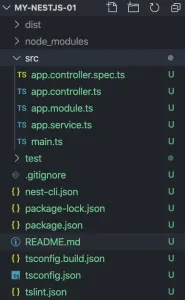
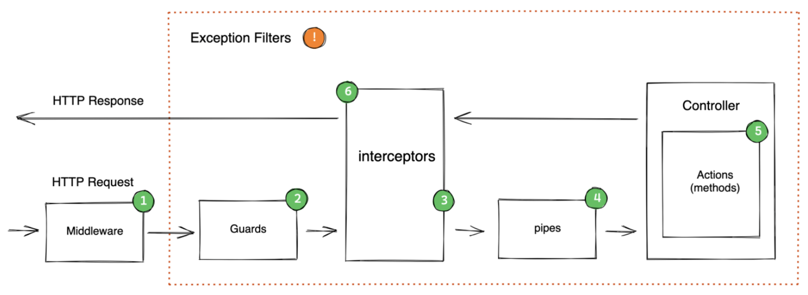
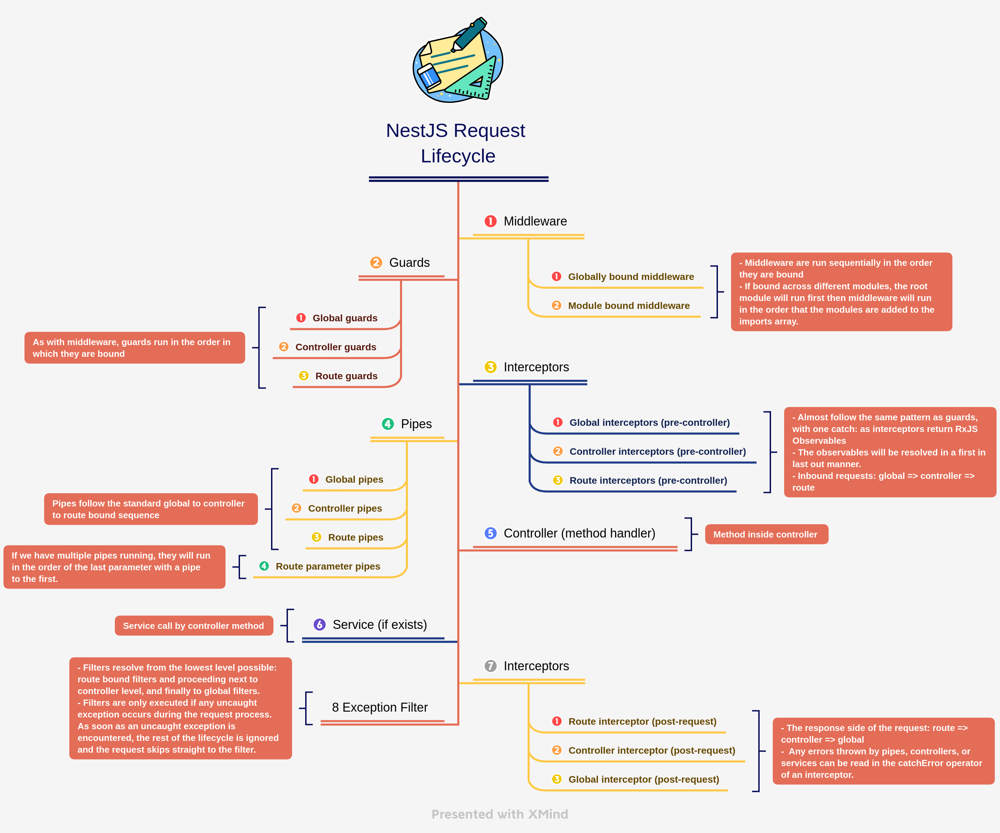
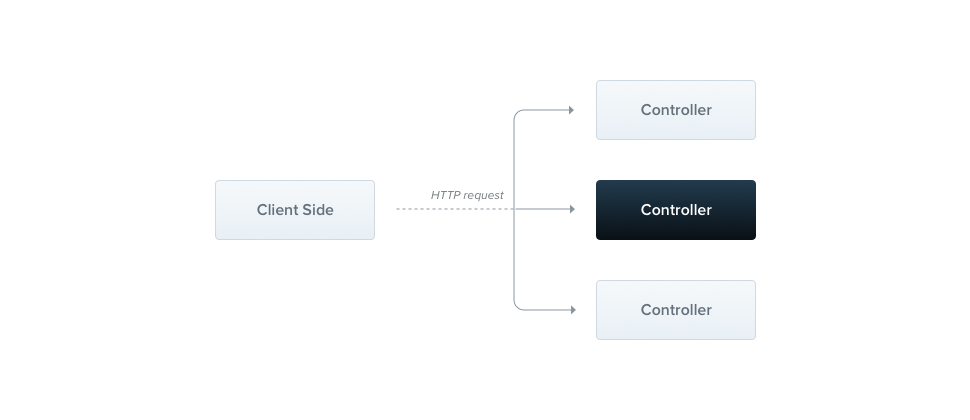
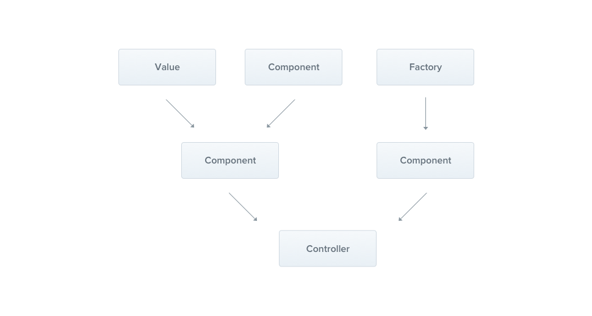
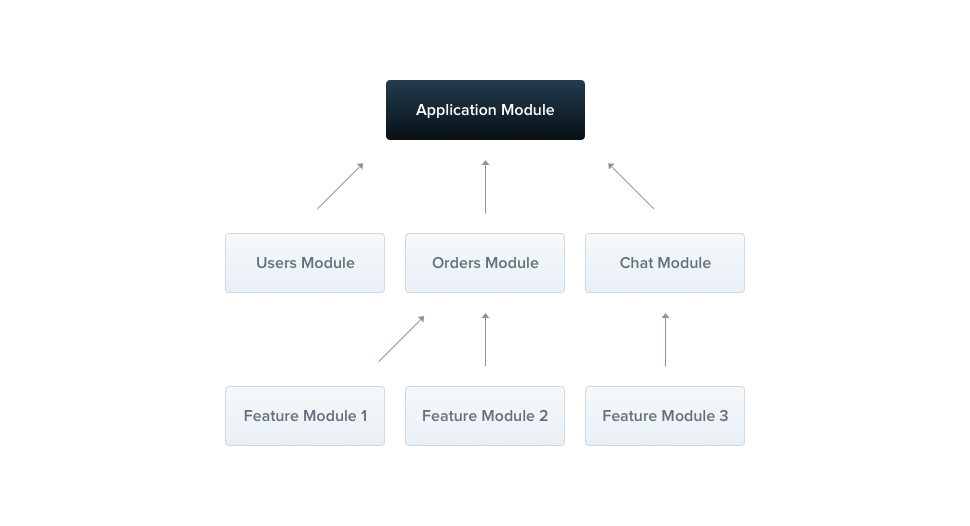

# Nestjs

## I. Giới thiệu
Nestjs là gì?
NestJS là một framework Node.JS cho phép xây dựng ứng dụng phía server. 
Đây là một framework mã nguồn mở, sử dụng TypeScript và rất linh hoạt để xây dựng các hệ thống backend.
Tại sao lại dùng Nestjs?
Cho phép develop nhanh và hiệu quả hơn. Khả năng mở rộng tốt, dễ bảo trì ứng dụng.
Là framework Node.js phát triển mạnh trong 3 năm trở lại đây. Cộng đồng hỗ trợ lớn, tích cực.
Kết hợp phát triển front-end và mid-tier, một đặc điểm vượt trội so với hầu hết các ngôn ngữ khác.
Sử dụng TypeScript, cho phép thích ứng nhanh chóng với các thay đổi khi JavaScript đang ngày càng phát triển mạnh mẽ.
Được xây dựng chuyên dùng cho các ứng dụng doanh nghiệp có quy mô lớn.
Cung cấp kiến trúc ứng dụng độc lập, cho phép các developer tạo ra những ứng dụng dễ test, dễ mở rộng và dễ bảo trì.
Cho phép xây dựng ứng dụng Rest API, MVC, microservices, GraphQL, Web Socket hay CRON job.
## II. Cách cài đặt
    - Yêu cầu nodejs >=16
    - Chọn folder bạn muốn lưu và bật terminal gõ câu lệnh sau
    - $ npm i -g @nestjs/cli
      $ nest new project-name
    - sau khi chạy 2 lệnh trên ta được folder nestjs với cấu trúc sau

    -Ta chỉ cần để ý đến thư mục src với ba file được tạo sẵn:
        . main.ts: File để khởi tạo các đối tượng chạy ứng dụng, chẳng hạn ta có thể dùng lệnh
        . NestFactory.create() để tạo instance cho Nest.
        . app.module.ts: Là module gốc của ứng dụng, có trách nhiệm đóng gói mọi thứ có trong project.
        . app.controller.ts: Chứa các router để xử lý các request và trả về response cho client.
        . app.services.ts: Chứa các hàm xử lý logic cho service, chẳng hạn như ứng dụng có service kết nối đến DB hoặc xử lý file,…
        . app.controller.spec.ts: File dùng để viết unit test cho các controller.

## III.Thành phần

    - 1 vòng đời requet trong nestjs:

        1. Middleware: Middleware được gọi đầu tiên khi request đến server, chúng ta thường dùng để xử lý và thay đổi thông tin request trước khi truyền đến route handler. Đây là thành phần đầu tiên được gọi nên thông thường khi cấu hình dự án chúng ta sẽ sử dụng chúng đầu tiên.

        2. Guard: 
            Mục đích duy nhất của Guard là xác định xem có cho phép request được xử lý bởi route handler hay không tại run-time. Có thể có thắc mắc Guard và Middleware đều xử lý logic tương tự nhau, tuy nhiên về bản chất thì Middleware sau khi gọi hàm next() thì sẽ không biết handler nào sẽ được gọi sau đó. Ngược lại, Guard nhờ vào việc có thể truy cập vào ExcecutionContext instance nên có thể biết được handler nào tiếp theo sẽ được gọi sau khi gọi hàm next(). Việc sử dụng Guard giúp chúng ta đưa logic xử lý vào chu trình của ứng dụng một cách rõ ràng và dễ hiểu

        3. Interceptors:  
            Nói sơ qua về Interceptors thì nó cho phép chúng ta xử lý các request và response trước khi chúng được xử lý bởi controller hoặc được trả về cho client. Vì thế chúng ta có thể chèn thêm custom logic vào quá trình xử lý request/response của ứng dụng

        4. Pipe: 
            Mục đích chính của Pipe là để kiểm tra, chuyển đổi và/hoặc sàng lọc dữ liệu được gửi và nhận về từ client.

        5. Controller: 
            Phần này thì không còn xa lạ gì với chúng ta, route handler xử lý logic chính của API được gọi tới.

        6. Service: 
            Service là nơi mà Controller gọi tới để xử lý yêu cầu, hoặc cũng có thể không cần gọi tới nếu bản thân Controller có thể tự giải quyết được
        
        7. Exception Filter: 
            Khác với NodeJS thuần, khi gặp exceptions ứng dụng sẽ bị crash,Exception filter được NestJS tạo ra để xử lý các ngoại lệ (exceptions) trong ứng dụng. 
            Nó giúp chúng ta kiểm soát và định hướng các ngoại lệ xảy ra trong ứng dụng và trả về một phản hồi thích hợp cho user. Nếu các exceptions không được chúng ta tự handle thì sẽ được chuyển đến cho Exception Filter xử lý

###     1. Controllers

        Controllers chịu trách nhiệm nhận các request từ clide side và trả lại thông qua routing. Và dưới đây là 1 ví đụ đơn giản

        `import { Controller, Get } from '@nestjs/common';

            @Controller('cats')
            export class CatsController {
            @Post('/create')
            create(@Body: body: any): string {
                return 'This action returns all cats';
            }
            @Get()
            findAll(): string {
                return 'This action returns all cats';
            }
            @Get(:id)
            findAll(): string {
                return 'This action returns all cats';
            }
            }`
###     Route:

            - NestJs controller hỗ trợ tốt cho các kiểu route thông thường như ví dụ trên và ở đây chúng ta cũng có thể dùng Route wildcards với cú pháp sau: `@Get('ab*cd')` thì nó sẽ mactch với "abcd", "abccd", "ab_cd".Dấu gạch nối ( -) và dấu chấm (.) được hiểu theo nghĩa đen bằng các đường dẫn dựa trên chuỗi.
###     Header

            - Chúng ta có thể tự custom respose header bằng cách sử dụng @Header() hoặc dùng res.header()
            `@Post()
             @Header('Cache-Control', 'none')
             create() {
                return 'This action adds a new cat';
             }`

###     2.Providers

            Trong NestJS, "providers" là một trong những khái niệm cơ bản và quan trọng nhất, chúng đóng một vai trò trung tâm trong cách thức hoạt động của ứng dụng. 

            Providers có thể là bất kỳ thứ gì có thể được "inject" (tiêm) vào các phần khác của ứng dụng, như là các lớp dịch vụ, giá trị hằng số, hoặc thậm chí là một hàm đơn giản. 

            Khái niệm này giúp NestJS hỗ trợ tính năng Dependency Injection (DI), một kỹ thuật thiết kế phần mềm cho phép việc tạo ra các lớp phụ thuộc một cách linh hoạt và dễ dàng quản lý.

            Dưới đây là một số điểm chính về providers trong NestJS:

            1. Khái niệm cơ bản:
                - Dependency Injection: Providers cho phép NestJS áp dụng mô hình Dependency Injection, giúp giảm sự phụ thuộc trực tiếp giữa các lớp phần mềm. 
                Thay vào đó, các phụ thuộc (dependencies) được "inject" vào lớp cần chúng thông qua constructor hoặc thông qua các setter/getter methods.
                - Reusable: Providers thường được tạo ra như là các singleton, điều này có nghĩa là bạn có thể tái sử dụng chúng trong nhiều phần khác nhau của ứng dụng mà không cần phải tạo ra nhiều thực thể.

            2. Cách sử dụng:
                - Trong một ứng dụng NestJS, ta có thể định nghĩa providers trong một module thông qua thuộc tính providers trong decorator @Module(). 
                Sau đó, ta có thể yêu cầu NestJS inject những providers này vào các controllers, các providers khác, hoặc modules thông qua constructor của chúng.

            3. Loại Providers:
                - Dịch vụ (Services): Lớp dịch vụ thực hiện một số logic kinh doanh cụ thể và có thể được inject vào các controllers hoặc các services khác.
                - Repositories: Các lớp thao tác dữ liệu, thường được sử dụng để tương tác với cơ sở dữ liệu.
                - Factory Providers: Cung cấp một hàm factory để tạo ra các providers.
                - Value Providers: Cung cấp một giá trị cụ thể làm provider, có thể hữu ích cho việc cấu hình ứng dụng hoặc cung cấp mock data cho testing.
                - Class Providers: Sử dụng một lớp cụ thể như một provider, cho phép bạn tùy chỉnh việc triển khai.

            4. Lợi ích:
                - Loose Coupling: Giảm sự phụ thuộc giữa các phần của ứng dụng, làm cho code dễ bảo trì và mở rộng hơn.
                - Testability: Việc sử dụng DI và providers giúp việc mock và test các phần của ứng dụng trở nên dễ dàng hơn.
                - Flexibility: Dễ dàng thay đổi giữa các triển khai của cùng một interface mà không cần sửa đổi code sử dụng interface đó.

###     3. Modules

        - Trong NestJS, module là một lớp được chú thích bằng decorator @Module(). Decorator @Module() cung cấp metadata mà NestJS sử dụng để tổ chức cấu trúc ứng dụng. Mỗi ứng dụng có ít nhất một module gốc, và module gốc này là điểm xuất phát mà NestJS sử dụng để xây dựng đồ thị ứng dụng - cấu trúc dữ liệu nội bộ mà NestJS dùng để giải quyết các mối quan hệ và phụ thuộc giữa module và provider.

        Module trong NestJS thường bao gồm:
            - Providers: Các dịch vụ sẽ được khởi tạo bởi injector của NestJS và có thể được chia sẻ ít nhất trong module này.
            - Controllers: Tập hợp các controller được định nghĩa trong module này và cần được khởi tạo.
            - Imports: Danh sách các module đã nhập khẩu mà xuất các providers cần thiết trong module này.
            - Exports: Tập con các providers được cung cấp bởi module này và nên có sẵn trong các module khác nhập khẩu module này
###     4. Middleware

            - Trong NestJs, middleware là một chức năng được gọi trước khi route handle xử lí yêu cầu. MiddleWare có quyền truy cập đối tượng request và respose cũng như hàm next()

            
            - Middle ware có thể thực hiện:
                . thực hiện bất kì code nào
                . thay đổi request và respose obj
                . kết thúc chu kì request-respose
                . gọi hàm middleware tiếp theo với next(). Nếu middleware hiện tại không được next() để sang bước tiếp theo thì request sẽ bị treo
            4.1. Global Bound Middleware:
                - Ở đây Middleware được đăng ký global trên toàn ứng dụng của chúng ta và sẽ được áp dụng cho tất cả các request được gửi đến. Chúng ta thường thấy khi sử dụng các package như cors, helmet, body-parser..
            4.2 2. Module Bound Middleware 
                - Middleware của phần này được sử dụng trong một module bất kỳ để thực hiện các chức năng riêng
            - MiddleWare trong nestjs có thể được triển khai dưới dạng hàm hoặc 1 lớp với decorator @Injectable

            - Trong lập trình, bộ bảo vệ là một mẫu phổ biến để kiểm soát luồng chương trình. Nó liên quan đến việc thực hiện kiểm tra có điều kiện để xác định xem việc thực thi mã nên tiếp tục hay thoát. Việc sử dụng các bộ bảo vệ có thể cải thiện khả năng đọc và bảo trì mã.

            - Guards trong NestJS hoạt động theo cách tương tự như trong lập trình chung, nhưng việc triển khai nó được tích hợp chặt chẽ với khung NestJS. Trách nhiệm của Guards là cho phép hoặc từ chối quyền truy cập vào điểm cuối NestJS. Ví dụ: chúng tôi có thể tạo trình bảo vệ để bảo vệ tuyến đường cập nhật hồ sơ của người dùng mà chỉ quản trị viên mới có thể truy cập được

