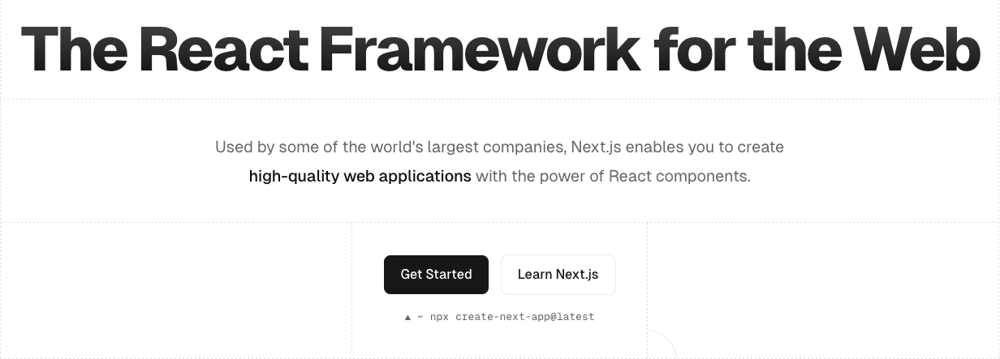
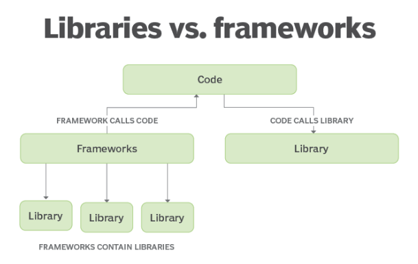
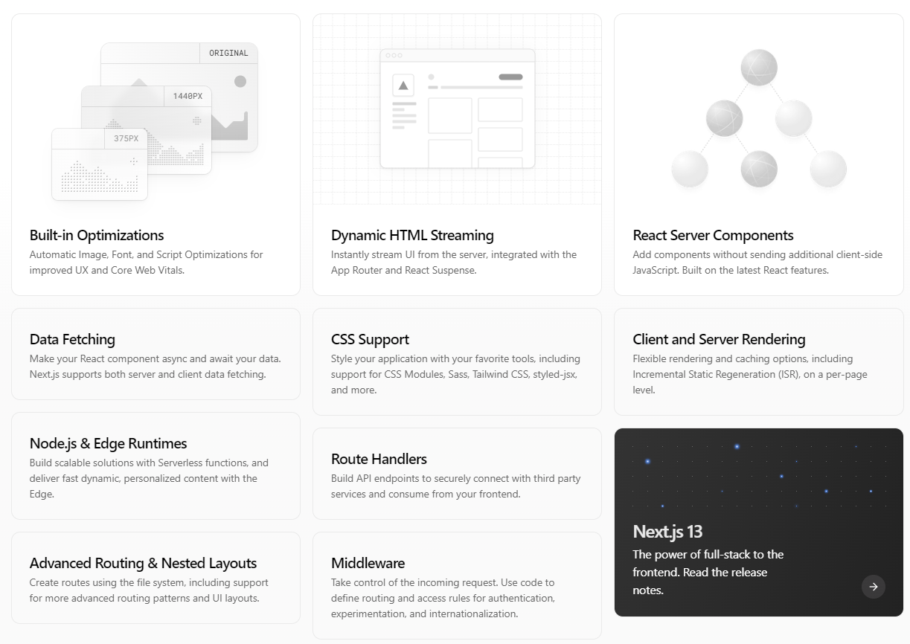

# WHAT

## 1. Introduction

**What**

- Have a fully understanding about how Next Js works

**Why**

- NextJs is a popular react framework to build for SEO and more

**Who**

- For frontend developer

**Where**

- NextJs official document, freecodecamp, Youtube,..

**When**

- When to use ReactJs or NextJs

**How**

- Project Based Learning

## 2. What is NextJs?

- The React framework for the Web ([https://nextjs.org/](https://nextjs.org/))
  
- **Library and Framework?**

  **Library**: to do something, to serve a purpose (when use React, you need add react-router-dom to handle routing,…)
  ⇒ Each project has one type of React project setup (React only has the role of building UI components)

  **Framework**: is the whole process, includes many libraries, does all the work

  

### **What's in NextJs? (**[https://nextjs.org/](https://nextjs.org/)) (5 mins)



- **Built-in Optimization**:

  - Image: [https://nextjs.org/docs/app/building-your-application/optimizing/images](https://nextjs.org/docs/app/building-your-application/optimizing/images)
    - Size Optimization: automatically serve correctly sized images for each device
    - Visual Stability: Prevent layout ship automatically when images are loading
    - Faster Page Loads: Images are only loaded when they enter the viewport using native browser lazy loading
    - ….

  ```tsx
  import Image from 'next/image';
  import profilePic from './me.png';

  export default function Page() {
    return (
      <Image
        src={profilePic}
        alt='Picture of the author'
        // width={500} automatically provided
        // height={500} automatically provided
        // blurDataURL="data:..." automatically provided
        // placeholder="blur" // Optional blur-up while loading
      />
    );
  }
  ```

  - Font

  ```tsx
  import { Inter } from 'next/font/google';

  // multiple fonts
  import { Inter, Roboto_Mono } from 'next/font/google';
  ```

  - Scripts

  ```tsx
  import Script from 'next/script';

  export default function DashboardLayout({
    children,
  }: {
    children: React.ReactNode;
  }) {
    return (
      <>
        <section>{children}</section>
        <Script src='https://example.com/script.js' />
      </>
    );
  }
  ```

  - Metadata,…

- **CSS support:**
  - Global CSS
  - CSS modules
  - Tailwind CSS
  - Sass
  - …..
- ….

### **Many famous website use NextJs (1 min)**

- Tiktok
- Twitch
- **Notion**
- **Github copilot**
- …

### **When to use ReactJs or NextJs (5-10 mins)**

|                      | ReactJs                                       | NextJs                                      |
| -------------------- | --------------------------------------------- | ------------------------------------------- |
| Type                 | Library                                       | Framework                                   |
| Github stars         | 212 k                                         | 111 k                                       |
| Rendering            | CSR                                           | CSR, SSR and SSG (\*)                       |
| Built-in SEO support | No (\*)                                       | Yes                                         |
| When to use          | Internal/Private web app, dashboard, admin,.. | Marketing/ Landing page/ Blog/ eCommerce,.. |
| …                    | …                                             | …                                           |

\*If want to SEO, need to build more things

\*CSR: Client side render

SSR: Server side render

SSG: Static Site Generation (pre-render data on server when build)

## 3. Setup env

- Node Js
- Font: FiraCode Font
- JavaScript (ES6) code snipets

## 4. NextJs for FE or BE or both?

NextJs build host in NodeJs server

⇒ can use for BE

However something different:

- Mindset between FE and BE: code style, coding convention,..
- Combine FE and BE into one project have many problem:
  - the project will be huge and cumbersome
  - difficulty in structuring the project
  - difficulty in scale the project

In practice, people will separate BE and FE into different repos, BE can have many repos (micro services), FE can have many repos (micro frontend)

**Conclusion**: not recommended for BE

## 5. How Next.js Works?

### 5.1. Compiling

> **What is Compiling?**

Các developers viết code bằng các ngôn ngữ thân thiện với các developers (developer-friendly) như JSX, TypeScript và các phiên bản hiện đại hơn của JavaScript. Mặc dù các ngôn ngữ này giúp các developers code hiệu quả hơn và tự tin hơn, tuy nhiên chúng cần được biên dịch (compiled) thành JavaScript trước để trình duyệt (browser) có thể hiểu được chúng.


Compiling đề cập đến quá trình lấy mã bằng một ngôn ngữ và xuất nó thành ngôn ngữ khác hoặc phiên bản khác của ngôn ngữ đó.

### 5.2. Minifying

> **What is Minifying?**
