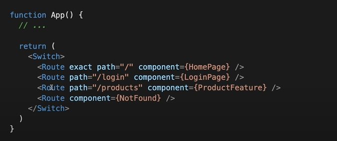
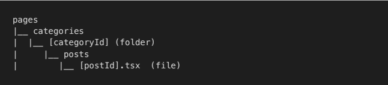

# CONCEPTS OF NEXT.JS

## 1. File-system routings

- ReactJs
  use **react-router-dom** to add routing
  

- But NextJs, we use **File-system Routing**, what does it means?
  

  When add file (.js/.jsx/.ts/.tsx/…) into folder **pages** ⇒ automatic available **as a route**
  There are three kind of routes:

  - _Index routes_: file name index
  - _Nested routes:_ nested folder in pages
  - _Dynamic routes:_ brackets in file name to match parameter dynamic

    **Single parameter:**

    `pages/posts/[postId].tsx will match:`

    |     | URL                   | router.query               |
    | --- | --------------------- | -------------------------- |
    | 1   | /posts/123            | {postId: ‘123’}            |
    | 2   | /posts/developer-tips | {postId: ‘developer-tips’} |
    |     |                       |                            |

    but it won't match **/posts/developer-roadmap/something-else**

    **Multiple parameters:** `pages/categories/[categoryId]/posts/[postId].tsx`

    |     | URL                          | router.query                             |
    | --- | ---------------------------- | ---------------------------------------- |
    | 1   | /categories/123/post/456     | { categoryId: '123', postId: '456' }     |
    | 2   | /categories/frontend/post/js | { categoryId: 'frontend', postId: 'js' } |
    |     |                              |                                          |

    

    **Dynamic routes**

    We can use dynamic routes (bracket syntax) to support path parameters.

    **Catch all routes:** `pages/posts/[...slug].tsx`

    |     | URL                    | router.query                        |
    | --- | ---------------------- | ----------------------------------- |
    | 1   | /posts/123             | { slug: ['123'] }                   |
    | 2   | /posts/develop         | { slug: ['develop'] }               |
    | 3   | /posts/develop/abc/123 | { slug: ['develop', ‘abc’, ‘123’] } |
    |     |                        |                                     |

## 2. Navigation

- Navigate between pages with `next/link`

  - Next Js execute navigate between pages with `client side routing` (not `full page reload`)

  ```tsx
  pages
  |__ index.tsx (HomePage)
  |__ about.tsx
  ```

  ```tsx
  import Link from 'next/link';

  function HomePage() {
    return (
      <Link href='/about'>
        <a>About Us</a>
      </Link>
    );
  }
  ```

  Keyword `full page reload` and `client side routing`?

  - When navigate between pages, page must load html again
  - But Next Js don’t. NextJs only load more file jsavascript and run it to execute navigate between pages.
    `<Link>` props

    | #   | Name     | Default | Desc                                                                         |
    | --- | -------- | ------- | ---------------------------------------------------------------------------- |
    | 1   | href     |         | REQUIRED. the path or URL to navigate to.                                    |
    | 2   | passHref | false   | Forces Link to send the href property to its child                           |
    | 3   | prefetch | true    | Prefetch the page in the background                                          |
    | 4   | replace  | false   | Replace the current history state instead of adding a new url into the stack |
    | 5   | scroll   | true    | Scroll to the top of the page after a navigation                             |
    | …   | …        | …       | …                                                                            |

  - Demo:

    Add `href` attribute in tag `<a>`
    Not `href` in `Link` component
    Replace tag `<a>` to tag `<div>`
    Navigate between two pages in **same folders**
    Navigate between two pages in **different folders**

- Navigate to a page programmatically using `router.push()`

  ```tsx
  import { useRouter } from 'next/router'
    function App() {
        const router = useRouter();
        function handleSubmit() {
            router.push('/success-page');
            // or using options object
            router.push({
                pathname: '/posts/[postId]',
                query: {
                postId: 123,
                ref: 'social',
                    },
                })
            }

        return (...);
  }

  ```

  `router` props

  | #   | Name       | Desc                                         |
  | --- | ---------- | -------------------------------------------- |
  | 1   | pathname   | current route                                |
  | 2   | query      | the query string parsed to an object         |
  | 3   | basePath   | the active basePath (if enabled)             |
  | 4   | locale     | the active locale (if enabled)               |
  | 5   | isFallback | whether the current page is in fallback mode |
  | …   | …          | …                                            |

  `router` methods

  | #   | Name              | Desc                                                  |
  | --- | ----------------- | ----------------------------------------------------- |
  | 1   | router.push()     | Handles client-side transitions                       |
  | 2   | router.replace()  | prevent adding a new URL entry into the history stack |
  | 3   | router.prefetch() | Prefetch pages for faster client-side transitions     |
  | 4   | router.back()     | Navigate back in history                              |
  | 5   | router.reload()   | executes window.location.reload()                     |
  | …   | …                 | …                                                     |

- How `pre-fetching` works
  Prefetch the page in the background for faster client-side transitions (by default Link will have prefetch turned ON)

  ```tsx
  function App() {
    return (
      <Link href='/pineapple-pizza'>
        <a>Pineapple pizza</a>
      </Link>
    );
  }
  ```

  - Note
    - Only prefetches links that appear **in the viewport**.
    - It use **Intersection Observer API** to detect.
    - Prefetching is **only enabled in production.**
    - But it will be **disabled in slow network** or when users have **Save-Data** turned on.
  - **Avoid unnecessary prefetching**

    ```tsx
    function App() {
      return (
        <Link href='/pineapple-pizza' prefetch={false}>
          <a>Pineapple pizza</a>
        </Link>
      );
    }
    ```

## 3. CSR, SSR, SSG and ISR

- **Pre-rendering**

- **CSR - Client Side Rendering**
  
  Client Side Rendering

- **SSR - Server Side Rendering**
  
  Server Side Rendering

- **SSG - Static Side Generation**
  
  Static Side Generation

- **ISR - Incremental Static Regeneration**
  
  Incremental Static Regeneration
- **Comparison ❓**

  - To compare these four techniques, we will consider following metrics

    - Build time
    - Suitable for Dynamic Content
    - Search Engine Optimization
    - Page Serve/Render Time
    - Most Recent Content
    - Static Server / App Server

    

  - **Conclusion**
    Can divide these rendering techniques into two major categories based on the level of dynamic interactions that app has.
    - CSR and SSR can be used to develop highly dynamic web application and both has its pros and cons depending on the scenario.
    - If you have a highly static content, you can use SSG or ISR. ISR is more advance and optimized, but it **requires specific platforms to work**.

## 4. Layout

## 5. Data Fetching (try with useSWR)

## 6. Protected route

## 7. SEO

## 8. i18n
