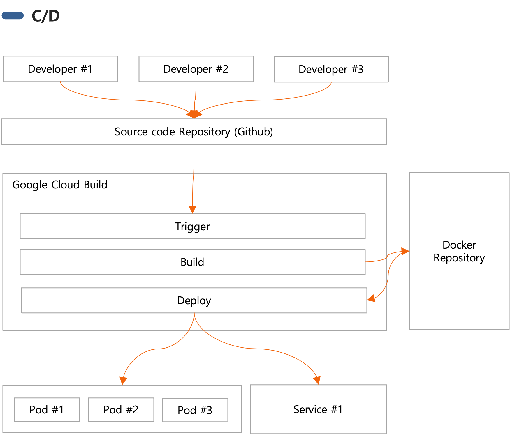

# 2. C/I & C/D

## 2.1 C/I (Continuous Integration)

- 개발자는 작업을 여러 번 일일이 중앙 저장소에 커밋하고 푸시
- 자동화된 빌드와 테스트 프로세스를 실행
- 프로덕션 준비 상태를 유지

## 2.2 C/D (Continuous Deployment)

- 소프트웨어를 언제든지 안전하게 배포할 수 있는 상태를 유지
- 변경사항이 자동화된 테스트와 빌드 프로세스를 거치면 즉시 프로덕션 환경에 자동으로 배포

