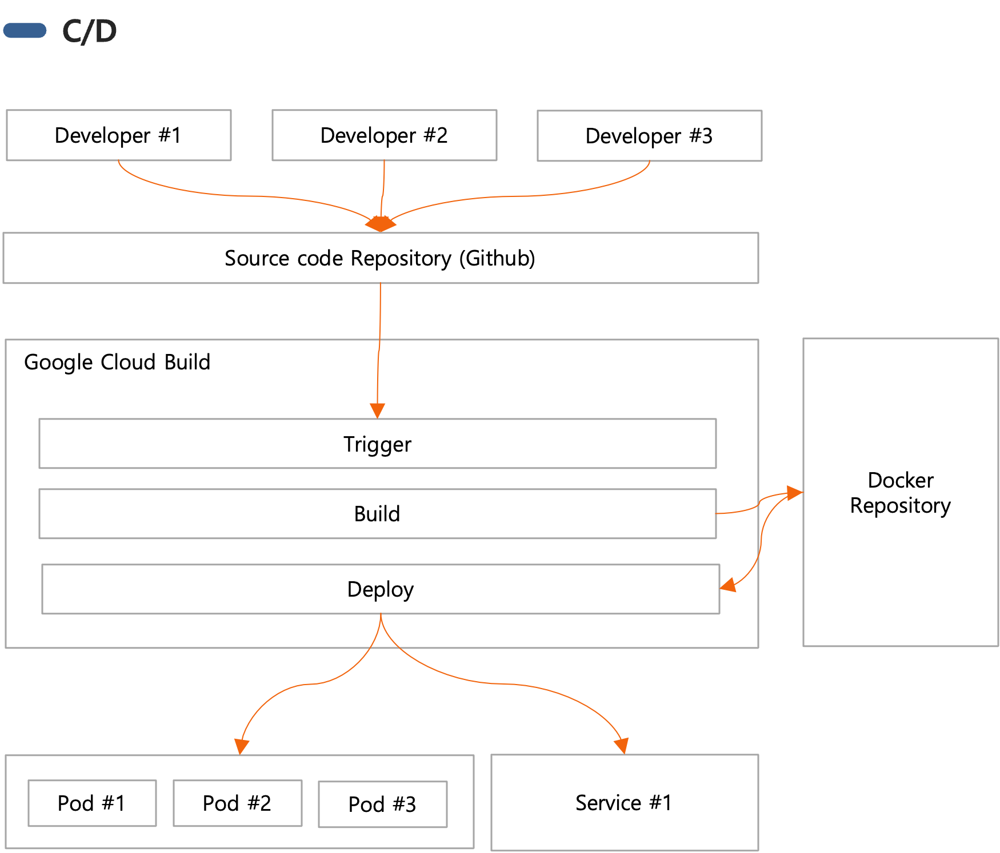

# 2. C/I & C/D

## 2.1 C/I (Continuous Integration)

- Các nhà phát triển thực hiện việc cam kết và đẩy công việc của họ nhiều lần mỗi ngày vào kho lưu trữ trung tâm.
- Thực hiện quá trình xây dựng và kiểm tra tự động.
- Duy trì tình trạng sẵn sàng cho sản xuất.

## 2.2 C/D (Continuous Deployment)

- Duy trì tình trạng luôn có thể triển khai phần mềm một cách an toàn.
- Mọi thay đổi, sau khi trải qua quá trình kiểm tra và xây dựng tự động, sẽ được triển khai tự động vào môi trường sản xuất.

