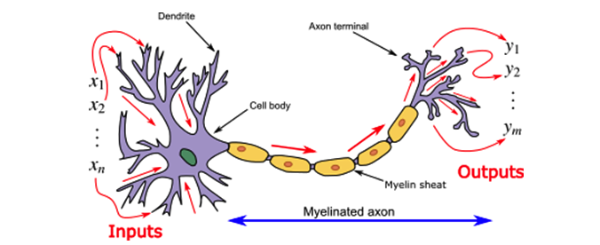
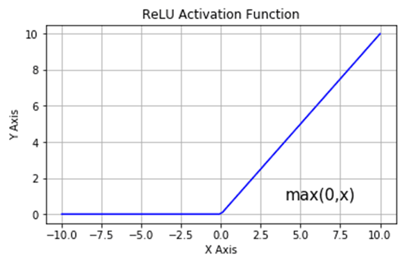
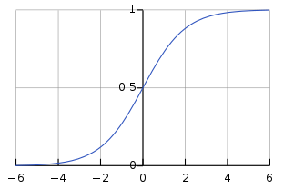

# 1. Neural Networks

## 1.1 신경망의 기본 구조

Neural Networks : 생물학적인 뉴런을 수학적으로 모델링

- 생물학적인 뉴련 : 다른 뉴런으로부터 입력(Dendrite)을 받아 특정 용량(Activation)을 넘어서면 외부(다음 뉴런의 입력) 로 출력값 전송



- Neural Networks : 입력 (x1, x2, x3) & 가중치 (θ1, θ2, θ3) 와 활성화 함수(Activation Function) 를 통해 츌력값 계산


## 1.2 활성화 함수

- 뉴런의 출력값을 결정하는 역할
- 주로 비선형 함수를 사용: 여러층의 선형 함수는 결국 하나의 선형 함수가 되기 때문

### 1.2.1 Sigmoid


- 출력 값의 범위가 0에서 1 사이
- 출력 값을 확률로 해석하는 데 유용
- 역전파 시, 오차 곱 계산에서 '그래디언트 소실(Vanishing Gradient)' 문제
- 오차 전파의 예시, 0.00000123 X 0.000000122

### 1.2.2 Tanh


- 출력 값의 범위가 -1에서 1 사이
- 역전파 시, 오차 곱 계산에서 '그래디언트 소실(Vanishing Gradient)' 문제

### 1.2.3 ReLU

```
f(x) = max(0, x)
```



- 음수 입력에 대해 0을 출력
- 양수 입력에 대해서는 입력 그대로 출력
- 그래디언트 소실 문제를 어느 정도 완화할
- 음수 값을 0으로 출력, '죽은 ReLU' 문제
- 특정 뉴런의 가중치가 0 이하만 출력하게 된다면, 해당 뉴런은 학습에 기여하지 않는 문제

### 1.2.4 Leaky ReLU

```
f(x) = max(0.01x, x)
```


- '죽은 ReLU' 문제를 해결하기 위해 제안
- 입력이 음수일 때 아주 작은 값을 출력

### 1.2.5 Softmax




- 주로 출력층에서 사용되는 활성화 함수
- 각 클래스에 대한 확률을 출력하도록 설계


## 1.3 손실 함수

## 1.4 최적화 알고리즘과 경사 하강법

## 1.5 역전파 (Backpropagation)

## 1.6 신경망의 학습과정

# 2. Convolutional Neural Networks (CNNs)

# 3. Recurrent Neural Networks (RNNs) and LSTM

# 4. Transformers and Attention Mechanism

# 5. Generative Models

# 6. Transfer Learning and Fine-tuning

# 7. Model Interpretability and Visualization

# 8. Optimization Techniques

# 9. Regularization and Overfitting

# 10. Deep Learning Libraries
