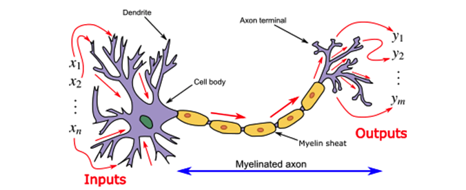
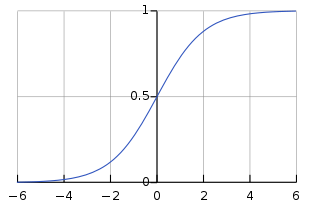

# 1. Mạng Nơ-ron

## 1.1 Cấu trúc cơ bản của mạng nơ-ron

Mạng Nơ-ron: Mô hình toán học của nơ-ron sinh học

- Nơ-ron sinh học: Nhận đầu vào (Dendrite) từ các nơ-ron khác và khi vượt quá dung lượng kích hoạt (Activation) sẽ truyền giá trị đầu ra ra ngoài (đầu vào của nơ-ron tiếp theo).



- Mạng Nơ-ron: Tính toán giá trị đầu ra thông qua đầu vào (x1, x2, x3) & trọng số (θ1, θ2, θ3) và hàm kích hoạt (Activation Function).


## 1.2 Hàm kích hoạt

- Xác định giá trị đầu ra của nơ-ron
- Thường sử dụng các hàm phi tuyến tính: vì nhiều hàm tuyến tính khi kết hợp lại sẽ chỉ tạo thành một hàm tuyến tính duy nhất.

### 1.2.1 Sigmoid


- Giá trị đầu ra nằm trong khoảng từ 0 đến 1
- Hữu ích khi giải thích giá trị đầu ra dưới dạng xác suất
- Khi lan truyền ngược, vấn đề 'Vanishing Gradient'

### 1.2.2 Tanh


- Giá trị đầu ra nằm trong khoảng từ -1 đến 1
- Khi lan truyền ngược, vấn đề 'Vanishing Gradient'

### 1.2.3 ReLU

```
f(x) = max(0, x)
```


- Đưa ra đầu ra 0 đối với đầu vào âm
- Đưa ra đầu vào như đầu ra cho đầu vào dương
- Giảm thiểu vấn đề 'Vanishing Gradient'
- Vấn đề 'ReLU chết'

### 1.2.4 Leaky ReLU

```
f(x) = max(0.01x, x)
```


- Được đề xuất để giải quyết vấn đề 'ReLU chết'
- Khi đầu vào là âm, nó sẽ đưa ra một giá trị rất nhỏ

### 1.2.5 Softmax




- Hàm kích hoạt thường được sử dụng ở lớp đầu ra
- Thiết kế để đưa ra xác suất cho mỗi lớp


