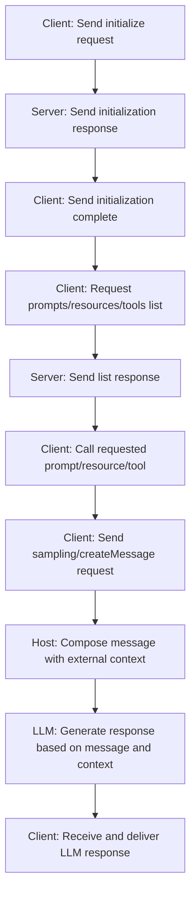

# Model Context Protocol (MCP) Overview and Protocol Details

This document explains the basic concepts, components (host, client, server), message schema, and protocol flow of the Model Context Protocol (MCP). It also briefly covers SDKs and open-source examples to help you get started easily.

---

## Table of Contents

1. [MCP Overview](#mcp-overview)
2. [Role Definition: Host, Client, Server](#role-definition-host-client-server)
3. [MCP Message Schema](#mcp-message-schema)
    - [JSON-RPC Based Structure](#json-rpc-based-structure)
    - [Main Message Types and Examples](#main-message-types-and-examples)
        - [Initialization and Session Management](#initialization-and-session-management)
        - [Prompt Related Messages](#prompt-related-messages)
        - [Resource Related Messages](#resource-related-messages)
        - [Tool Related Messages](#tool-related-messages)
        - [LLM Response Generation (Sampling)](#llm-response-generation-sampling)
        - [Root Related Messages](#root-related-messages)
4. [Protocol Flow (Flowchart)](#protocol-flow-flowchart)
5. [SDKs and Open Source Tools](#sdks-and-open-source-tools)

---

## MCP Overview

Model Context Protocol (MCP) is a **standardized communication protocol** for connecting Large Language Models (LLMs) with external data sources or tools (file systems, databases, APIs, etc.).  
The main purpose is to enable LLM applications to receive necessary additional context (data, prompts, tool results, etc.) in a standardized way.

---

## Role Definition: Host, Client, Server

-   **Host**

    -   **Definition:** The LLM application or tool itself (e.g., AI chatbot, IDE extension, etc.).
    -   **Role:** Coordinates the entire request and collects external context to deliver to the model.

-   **Client**

    -   **Definition:** A dedicated MCP communication module within the host that handles JSON-RPC message exchange with the MCP server.
    -   **Role:** Manages the connection between the host and MCP server, and transmits request/response messages.

-   **Server**

    -   **Definition:** A service that exposes external data or tools (e.g., file system, API, Vision model, etc.) through the MCP interface.
    -   **Role:** Acts as an "information provider" that creates or processes data to provide context to the LLM.

-   **MCP Component Role Summary**

| Component      | Role Description                                                                                                 |
| -------------- | ---------------------------------------------------------------------------------------------------------------- |
| **MCP Host**   | 🧠 **Selects/Combines** appropriate MCP servers and prompts based on user's natural language requests            |
| **MCP Client** | 🔌 **Communication Handler** that sends messages to and receives responses from the server based on MCP protocol |
| **MCP Server** | 📦 **Data/Function Provider** that defines and provides prompts, tools, resources, etc.                          |

> **Example (Mobile App-based Photo Analysis App)**
>
> -   **Mobile App (Frontend):** Simple user interface role, not directly included in MCP structure
> -   **Backend Server:** Acts as MCP **Host** and internally communicates with external (e.g., photo storage MCP server) through MCP **Client**
> -   **Photo Storage/Analysis Server:** MCP **Server** that provides photo metadata or Vision model results

---

## MCP Message Schema

MCP exchanges messages based on the JSON-RPC 2.0 standard. All messages follow the following basic structure.

### JSON-RPC Based Structure

-   **Common Fields:**
    -   `"jsonrpc": "2.0"`
    -   Requests include `"id"`, `"method"`, and `"params"` fields
    -   Responses include the request's `"id"` along with either `"result"` or `"error"` fields
    -   Notifications are sent without `"id"` and have no response

### Main Message Types and Examples

#### Initialization and Session Management

-   **Initialize Request:**  
    Requests initial connection to the server including protocol version, capabilities, and client information.

    ```json
    {
        "jsonrpc": "2.0",
        "id": "init1",
        "method": "initialize",
        "params": {
            "protocolVersion": "2024-11-05",
            "capabilities": { "roots": { "listChanged": true }, "sampling": {} },
            "clientInfo": { "name": "SomeClient", "version": "1.2.3" }
        }
    }
    ```

-   **Initialize Response:**
    ```json
    {
        "jsonrpc": "2.0",
        "id": "init1",
        "result": {
            "protocolVersion": "2024-11-05",
            "capabilities": { "prompts": { "listChanged": true }, "tools": {} },
            "serverInfo": { "name": "MyServer", "version": "0.8.15" }
        }
    }
    ```

#### Prompt Related Messages

-   **List Prompts:**
    ```json
    {
        "jsonrpc": "2.0",
        "id": 1,
        "method": "prompts/list",
        "params": { "cursor": "optional-cursor-value" }
    }
    ```
-   **List Prompts Response:**

    ```json
    {
        "jsonrpc": "2.0",
        "id": 1,
        "result": {
            "prompts": [
                {
                    "name": "code_review",
                    "description": "Analyze code quality and suggest improvements",
                    "arguments": [
                        {
                            "name": "code",
                            "description": "The source code to review",
                            "required": true
                        }
                    ]
                },
                {
                    "name": "summarize_text",
                    "description": "Summarize a given text document",
                    "arguments": [
                        {
                            "name": "text",
                            "description": "The text to summarize",
                            "required": true
                        }
                    ]
                }
            ],
            "nextCursor": null
        }
    }
    ```

-   **Get Prompt:**
    ```json
    {
        "jsonrpc": "2.0",
        "id": 2,
        "method": "prompts/get",
        "params": {
            "name": "code_review",
            "arguments": { "code": "def hello():\n    print('world')" }
        }
    }
    ```
-   **Get Prompt Response:**
    ```json
    {
        "jsonrpc": "2.0",
        "id": 2,
        "result": {
            "description": "Code review prompt",
            "messages": [
                {
                    "role": "user",
                    "content": {
                        "type": "text",
                        "text": "Please review the following code and suggest improvements:\n\n{{code}}"
                    }
                }
            ]
        }
    }
    ```

#### Resource Related Messages

-   **List Resources:**

    ```json
    {
        "jsonrpc": "2.0",
        "id": 10,
        "method": "resources/list",
        "params": { "cursor": "optional-cursor-value" }
    }
    ```

-   **Read Resource:**

    ```json
    {
        "jsonrpc": "2.0",
        "id": 11,
        "method": "resources/read",
        "params": { "uri": "file:///project/src/main.rs" }
    }
    ```

#### Tool Related Messages

-   **List Tools:**

    ```json
    {
        "jsonrpc": "2.0",
        "id": 20,
        "method": "tools/list",
        "params": { "cursor": "optional-cursor-value" }
    }
    ```

-   **Call Tool:**

    ```json
    {
        "jsonrpc": "2.0",
        "id": 21,
        "method": "tools/call",
        "params": {
            "name": "get_weather",
            "arguments": { "location": "New York" }
        }
    }
    ```

#### LLM Response Generation (Sampling; sampling/createMessage)

-   **LLM Message Generation Request:**

    ```json
    {
        "jsonrpc": "2.0",
        "id": 5,
        "method": "sampling/createMessage",
        "params": {
            "messages": [
                {
                    "role": "user",
                    "content": { "type": "text", "text": "What is the capital of France?" }
                }
            ],
            "modelPreferences": {
                "hints": [{ "name": "claude-3-sonnet" }],
                "intelligencePriority": 0.8,
                "speedPriority": 0.5
            },
            "systemPrompt": "You are a helpful assistant.",
            "maxTokens": 100
        }
    }
    ```

-   **LLM Response Example:**

    ```json
    {
        "jsonrpc": "2.0",
        "id": 5,
        "result": {
            "role": "assistant",
            "content": { "type": "text", "text": "The capital of France is Paris." },
            "model": "claude-3-sonnet-20240307",
            "stopReason": "endTurn"
        }
    }
    ```

#### Root Related Messages

-   **List Roots:**

    ```json
    {
        "jsonrpc": "2.0",
        "id": 30,
        "method": "roots/list"
    }
    ```

-   **Root Response Example:**

    ```json
    {
        "jsonrpc": "2.0",
        "id": 30,
        "result": {
            "roots": [{ "uri": "file:///home/user/projects/myproject", "name": "My Project" }]
        }
    }
    ```

## Protocol Flow (Flowchart)



## SDKs and Open Source Tools

-   **SDKs:**

    -   [MCP SDK for Python](https://github.com/your-project/mcp-sdk-python)
    -   [MCP SDK for JavaScript](https://github.com/your-project/mcp-sdk-js)
    -   [MCP SDK for Java](https://github.com/your-project/mcp-sdk-java)

-   **Open Source Tools:**
    -   [MCP Example Project](https://github.com/your-project/mcp-example-project)
    -   [MCP Integration Guide](https://github.com/your-project/mcp-integration-guide)
