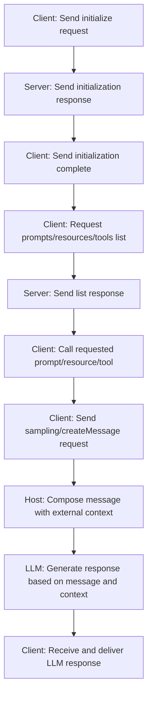

# Model Context Protocol (MCP) 개요 및 프로토콜 상세

이 문서는 Model Context Protocol(MCP)의 기본 개념, 구성 요소(호스트, 클라이언트, 서버)와 메시지 스키마, 그리고 프로토콜 흐름을 설명합니다. 또한, 이를 쉽게 사용할 수 있는 SDK 및 오픈소스 예제에 대해서도 간략하게 다룹니다.

---

## 목차

1. [MCP 개요](#mcp-개요)
2. [역할 구분: 호스트, 클라이언트, 서버](#역할-구분-호스트-클라이언트-서버)
3. [MCP 메시지 스키마](#mcp-메시지-스키마)
    - [JSON-RPC 기반 구조](#json-rpc-기반-구조)
    - [주요 메시지 유형 및 예시](#주요-메시지-유형-및-예시)
        - [초기화 및 세션 관리](#초기화-및-세션-관리)
        - [프롬프트 관련 메시지](#프롬프트-관련-메시지)
        - [리소스 관련 메시지](#리소스-관련-메시지)
        - [툴(도구) 관련 메시지](#툴도구-관련-메시지)
        - [LLM 응답 생성 (샘플링)](#llm-응답-생성-샘플링)
        - [루트 관련 메시지](#루트-관련-메시지)
4. [프로토콜 플로우 (Flowchart)](#프로토콜-플로우-flowchart)
5. [SDK 및 오픈소스 도구](#sdk-및-오픈소스-도구)

---

## MCP 개요

Model Context Protocol(MCP)는 대형 언어 모델(LLM)과 외부 데이터 소스 또는 도구(파일 시스템, 데이터베이스, API 등)를 연결하기 위한 **표준화된 통신 프로토콜**입니다.  
주요 목적은 LLM 애플리케이션이 필요한 추가 컨텍스트(데이터, 프롬프트, 도구 결과 등)를 표준화된 방식으로 전달받을 수 있도록 하는 데 있습니다.

---

## 역할 구분: 호스트, 클라이언트, 서버

-   **호스트 (Host)**

    -   **정의:** LLM 애플리케이션이나 도구(예: AI 챗봇, IDE 확장 등) 자체를 의미합니다.
    -   **역할:** 전체 요청을 조율하고, 외부 컨텍스트를 수집하여 모델에게 전달합니다.

-   **클라이언트 (Client)**

    -   **정의:** 호스트 내에 존재하는 MCP 전용 통신 모듈로, MCP 서버와의 JSON-RPC 메시지 교환을 담당합니다.
    -   **역할:** 호스트와 MCP 서버 간의 연결을 관리하고, 요청/응답 메시지를 전송합니다.

-   **서버 (Server)**

    -   **정의:** 외부 데이터나 도구(예: 파일 시스템, API, Vision 모델 등)를 MCP 인터페이스로 노출하는 서비스입니다.
    -   **역할:** LLM에 전달할 컨텍스트를 생성하거나, 데이터를 가공하여 제공하는 "정보 공급자"입니다.

-   **MCP 구성 요소 역할 정리**

| 컴포넌트                    | 역할 설명                                                                          |
| --------------------------- | ---------------------------------------------------------------------------------- |
| **MCP 호스트 (Host)**       | 🧠 사용자의 자연어 요청을 해석하고, 그에 맞는 MCP 서버 및 프롬프트를 **선택/조합** |
| **MCP 클라이언트 (Client)** | 🔌 MCP 프로토콜 기반으로 서버에 메시지를 전송하고, 응답을 받아오는 **통신 담당자** |
| **MCP 서버 (Server)**       | 📦 프롬프트, 툴, 리소스 등을 정의하고 제공하는 **데이터/기능 제공자**              |

> **예시 (모바일 앱 기반 사진 분석 앱)**
>
> -   **모바일 앱 (프론트엔드):** 단순 사용자 인터페이스 역할, MCP 구조에 직접 포함되지 않음
> -   **백엔드 서버:** MCP **호스트**이자 내부적으로 MCP **클라이언트**를 통해 외부(예: 사진 저장소 MCP 서버)와 통신
> -   **사진 저장소/분석 서버:** 사진 메타데이터나 Vision 모델 결과를 제공하는 MCP **서버**

---

## MCP 메시지 스키마

MCP는 JSON-RPC 2.0 표준에 기반하여 메시지들을 주고받습니다. 모든 메시지는 다음과 같은 기본 구조를 가집니다.

### JSON-RPC 기반 구조

-   **공통 필드:**
    -   `"jsonrpc": "2.0"`
    -   요청(Request)에는 `"id"`, `"method"`, `"params"` 필드가 포함됨
    -   응답(Response)에는 요청의 `"id"`와 함께 `"result"` 또는 `"error"` 필드가 포함됨
    -   알림(Notification)은 `"id"` 없이 전송되며 응답이 없음

### 주요 메시지 유형 및 예시

#### 초기화 및 세션 관리

-   **초기화 요청 (`initialize`):**  
    클라이언트가 지원하는 프로토콜 버전, 기능(capabilities) 및 클라이언트 정보를 포함하여 서버에 초기 연결을 요청합니다.

    ```json
    {
        "jsonrpc": "2.0",
        "id": "init1",
        "method": "initialize",
        "params": {
            "protocolVersion": "2024-11-05",
            "capabilities": { "roots": { "listChanged": true }, "sampling": {} },
            "clientInfo": { "name": "SomeClient", "version": "1.2.3" }
        }
    }
    ```

-   **초기화 응답:**
    ```json
    {
        "jsonrpc": "2.0",
        "id": "init1",
        "result": {
            "protocolVersion": "2024-11-05",
            "capabilities": { "prompts": { "listChanged": true }, "tools": {} },
            "serverInfo": { "name": "MyServer", "version": "0.8.15" }
        }
    }
    ```

#### 프롬프트 관련 메시지

-   **프롬프트 목록 조회 (prompts/list):**
    ```json
    {
        "jsonrpc": "2.0",
        "id": 1,
        "method": "prompts/list",
        "params": { "cursor": "optional-cursor-value" }
    }
    ```
-   **프롬프트 목록 조회 응답:**

    ```json
    {
        "jsonrpc": "2.0",
        "id": 1,
        "result": {
            "prompts": [
                {
                    "name": "code_review",
                    "description": "Analyze code quality and suggest improvements",
                    "arguments": [
                        {
                            "name": "code",
                            "description": "The source code to review",
                            "required": true
                        }
                    ]
                },
                {
                    "name": "summarize_text",
                    "description": "Summarize a given text document",
                    "arguments": [
                        {
                            "name": "text",
                            "description": "The text to summarize",
                            "required": true
                        }
                    ]
                }
            ],
            "nextCursor": null
        }
    }
    ```

-   **프롬프트 내용 조회 (prompts/get):**
    ```json
    {
        "jsonrpc": "2.0",
        "id": 2,
        "method": "prompts/get",
        "params": {
            "name": "code_review",
            "arguments": { "code": "def hello():\n    print('world')" }
        }
    }
    ```
-   **프롬프트 내용 조회 응답:**
    ```json
    {
        "jsonrpc": "2.0",
        "id": 2,
        "result": {
            "description": "Code review prompt",
            "messages": [
                {
                    "role": "user",
                    "content": {
                        "type": "text",
                        "text": "Please review the following code and suggest improvements:\n\n{{code}}"
                    }
                }
            ]
        }
    }
    ```

#### 리소스 관련 메시지

-   **리소스 목록 조회 (resources/list):**

    ```json
    {
        "jsonrpc": "2.0",
        "id": 10,
        "method": "resources/list",
        "params": { "cursor": "optional-cursor-value" }
    }
    ```

-   **리소스 읽기 (resources/read):**

    ```json
    {
        "jsonrpc": "2.0",
        "id": 11,
        "method": "resources/read",
        "params": { "uri": "file:///project/src/main.rs" }
    }
    ```

#### 툴(도구) 관련 메시지

-   **툴 목록 조회 (tools/list):**

    ```json
    {
        "jsonrpc": "2.0",
        "id": 20,
        "method": "tools/list",
        "params": { "cursor": "optional-cursor-value" }
    }
    ```

-   **툴 호출 (tools/call):**

    ```json
    {
        "jsonrpc": "2.0",
        "id": 21,
        "method": "tools/call",
        "params": {
            "name": "get_weather",
            "arguments": { "location": "New York" }
        }
    }
    ```

#### LLM 응답 생성 (샘플링; sampling/createMessage)

-   **LLM 메시지 생성 요청:**

    ```json
    {
        "jsonrpc": "2.0",
        "id": 5,
        "method": "sampling/createMessage",
        "params": {
            "messages": [
                {
                    "role": "user",
                    "content": { "type": "text", "text": "What is the capital of France?" }
                }
            ],
            "modelPreferences": {
                "hints": [{ "name": "claude-3-sonnet" }],
                "intelligencePriority": 0.8,
                "speedPriority": 0.5
            },
            "systemPrompt": "You are a helpful assistant.",
            "maxTokens": 100
        }
    }
    ```

-   **LLM 응답 예시:**

    ```json
    {
        "jsonrpc": "2.0",
        "id": 5,
        "result": {
            "role": "assistant",
            "content": { "type": "text", "text": "The capital of France is Paris." },
            "model": "claude-3-sonnet-20240307",
            "stopReason": "endTurn"
        }
    }
    ```

#### 루트 관련 메시지

-   **루트 목록 조회 (roots/list):**

    ```json
    {
        "jsonrpc": "2.0",
        "id": 30,
        "method": "roots/list"
    }
    ```

-   **루트 응답 예시:**

    ```json
    {
        "jsonrpc": "2.0",
        "id": 30,
        "result": {
            "roots": [{ "uri": "file:///home/user/projects/myproject", "name": "My Project" }]
        }
    }
    ```

## 프로토콜 플로우 (Flowchart)


