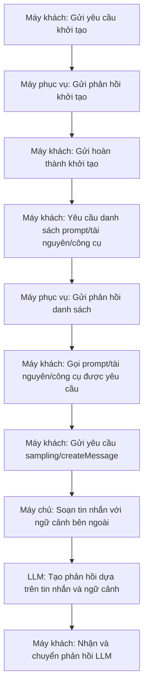

# Tổng quan về Giao thức Ngữ cảnh Mô hình (MCP) và Chi tiết Giao thức

Tài liệu này giải thích các khái niệm cơ bản, các thành phần (máy chủ, máy khách, máy phục vụ), lược đồ tin nhắn và luồng giao thức của Giao thức Ngữ cảnh Mô hình (MCP). Nó cũng đề cập ngắn gọn về SDK và các ví dụ mã nguồn mở để giúp bạn dễ dàng bắt đầu.

---

## Mục lục

1. [Tổng quan về MCP](#tổng-quan-về-mcp)
2. [Định nghĩa Vai trò: Máy chủ, Máy khách, Máy phục vụ](#định-nghĩa-vai-trò-máy-chủ-máy-khách-máy-phục-vụ)
3. [Lược đồ Tin nhắn MCP](#lược-đồ-tin-nhắn-mcp)
    - [Cấu trúc Dựa trên JSON-RPC](#cấu-trúc-dựa-trên-json-rpc)
    - [Các Loại Tin nhắn Chính và Ví dụ](#các-loại-tin-nhắn-chính-và-ví-dụ)
        - [Khởi tạo và Quản lý Phiên](#khởi-tạo-và-quản-lý-phiên)
        - [Tin nhắn Liên quan đến Prompt](#tin-nhắn-liên-quan-đến-prompt)
        - [Tin nhắn Liên quan đến Tài nguyên](#tin-nhắn-liên-quan-đến-tài-nguyên)
        - [Tin nhắn Liên quan đến Công cụ](#tin-nhắn-liên-quan-đến-công-cụ)
        - [Tạo Phản hồi LLM (Lấy mẫu)](#tạo-phản-hồi-llm-lấy-mẫu)
        - [Tin nhắn Liên quan đến Root](#tin-nhắn-liên-quan-đến-root)
4. [Luồng Giao thức (Sơ đồ)](#luồng-giao-thức-sơ-đồ)
5. [SDK và Công cụ Mã nguồn Mở](#sdk-và-công-cụ-mã-nguồn-mở)

---

## Tổng quan về MCP

Giao thức Ngữ cảnh Mô hình (MCP) là một **giao thức truyền thông chuẩn hóa** để kết nối Mô hình Ngôn ngữ Lớn (LLM) với các nguồn dữ liệu hoặc công cụ bên ngoài (hệ thống tệp, cơ sở dữ liệu, API, v.v.).  
Mục đích chính là cho phép các ứng dụng LLM nhận được ngữ cảnh bổ sung cần thiết (dữ liệu, prompt, kết quả công cụ, v.v.) theo cách chuẩn hóa.

---

## Định nghĩa Vai trò: Máy chủ, Máy khách, Máy phục vụ

-   **Máy chủ (Host)**

    -   **Định nghĩa:** Bản thân ứng dụng hoặc công cụ LLM (ví dụ: chatbot AI, tiện ích mở rộng IDE, v.v.).
    -   **Vai trò:** Điều phối toàn bộ yêu cầu và thu thập ngữ cảnh bên ngoài để chuyển đến mô hình.

-   **Máy khách (Client)**

    -   **Định nghĩa:** Mô-đun truyền thông MCP chuyên dụng trong máy chủ, xử lý trao đổi tin nhắn JSON-RPC với máy phục vụ MCP.
    -   **Vai trò:** Quản lý kết nối giữa máy chủ và máy phục vụ MCP, và truyền tin nhắn yêu cầu/phản hồi.

-   **Máy phục vụ (Server)**

    -   **Định nghĩa:** Một dịch vụ bộc lộ dữ liệu hoặc công cụ bên ngoài (ví dụ: hệ thống tệp, API, mô hình Vision, v.v.) thông qua giao diện MCP.
    -   **Vai trò:** Hoạt động như một "nhà cung cấp thông tin" tạo hoặc xử lý dữ liệu để cung cấp ngữ cảnh cho LLM.

-   **Tóm tắt Vai trò Thành phần MCP**

| Thành phần          | Mô tả Vai trò                                                                                           |
| ------------------- | ------------------------------------------------------------------------------------------------------- |
| **Máy chủ MCP**     | 🧠 **Chọn/Kết hợp** máy phục vụ và prompt MCP phù hợp dựa trên yêu cầu ngôn ngữ tự nhiên của người dùng |
| **Máy khách MCP**   | 🔌 **Xử lý Truyền thông** gửi tin nhắn đến và nhận phản hồi từ máy phục vụ dựa trên giao thức MCP       |
| **Máy phục vụ MCP** | 📦 **Nhà cung cấp Dữ liệu/Chức năng** định nghĩa và cung cấp prompt, công cụ, tài nguyên, v.v.          |

> **Ví dụ (Ứng dụng Phân tích Ảnh dựa trên Ứng dụng Di động)**
>
> -   **Ứng dụng Di động (Frontend):** Vai trò giao diện người dùng đơn giản, không được bao gồm trực tiếp trong cấu trúc MCP
> -   **Máy chủ Backend:** Hoạt động như **Máy chủ** MCP và giao tiếp nội bộ với bên ngoài (ví dụ: máy phục vụ lưu trữ ảnh MCP) thông qua **Máy khách** MCP
> -   **Máy chủ Lưu trữ/Phân tích Ảnh:** **Máy phục vụ** MCP cung cấp siêu dữ liệu ảnh hoặc kết quả mô hình Vision

---

## Lược đồ Tin nhắn MCP

MCP trao đổi tin nhắn dựa trên tiêu chuẩn JSON-RPC 2.0. Tất cả tin nhắn tuân theo cấu trúc cơ bản sau.

### Cấu trúc Dựa trên JSON-RPC

-   **Trường Chung:**
    -   `"jsonrpc": "2.0"`
    -   Yêu cầu bao gồm các trường `"id"`, `"method"` và `"params"`
    -   Phản hồi bao gồm `"id"` của yêu cầu cùng với trường `"result"` hoặc `"error"`
    -   Thông báo được gửi không có `"id"` và không có phản hồi

### Các Loại Tin nhắn Chính và Ví dụ

#### Khởi tạo và Quản lý Phiên

-   **Yêu cầu Khởi tạo:**  
    Yêu cầu kết nối ban đầu với máy phục vụ bao gồm phiên bản giao thức, khả năng và thông tin máy khách.

    ```json
    {
        "jsonrpc": "2.0",
        "id": "init1",
        "method": "initialize",
        "params": {
            "protocolVersion": "2024-11-05",
            "capabilities": { "roots": { "listChanged": true }, "sampling": {} },
            "clientInfo": { "name": "SomeClient", "version": "1.2.3" }
        }
    }
    ```

-   **Phản hồi Khởi tạo:**
    ```json
    {
        "jsonrpc": "2.0",
        "id": "init1",
        "result": {
            "protocolVersion": "2024-11-05",
            "capabilities": { "prompts": { "listChanged": true }, "tools": {} },
            "serverInfo": { "name": "MyServer", "version": "0.8.15" }
        }
    }
    ```

#### Tin nhắn Liên quan đến Prompt

-   **Liệt kê Prompt:**
    ```json
    {
        "jsonrpc": "2.0",
        "id": 1,
        "method": "prompts/list",
        "params": { "cursor": "optional-cursor-value" }
    }
    ```
-   **Phản hồi Liệt kê Prompt:**

    ```json
    {
        "jsonrpc": "2.0",
        "id": 1,
        "result": {
            "prompts": [
                {
                    "name": "code_review",
                    "description": "Phân tích chất lượng mã và đề xuất cải tiến",
                    "arguments": [
                        {
                            "name": "code",
                            "description": "Mã nguồn cần xem xét",
                            "required": true
                        }
                    ]
                },
                {
                    "name": "summarize_text",
                    "description": "Tóm tắt một tài liệu văn bản đã cho",
                    "arguments": [
                        {
                            "name": "text",
                            "description": "Văn bản cần tóm tắt",
                            "required": true
                        }
                    ]
                }
            ],
            "nextCursor": null
        }
    }
    ```

-   **Lấy Prompt:**
    ```json
    {
        "jsonrpc": "2.0",
        "id": 2,
        "method": "prompts/get",
        "params": {
            "name": "code_review",
            "arguments": { "code": "def hello():\n    print('world')" }
        }
    }
    ```
-   **Phản hồi Lấy Prompt:**
    ```json
    {
        "jsonrpc": "2.0",
        "id": 2,
        "result": {
            "description": "Prompt xem xét mã",
            "messages": [
                {
                    "role": "user",
                    "content": {
                        "type": "text",
                        "text": "Vui lòng xem xét mã sau và đề xuất cải tiến:\n\n{{code}}"
                    }
                }
            ]
        }
    }
    ```

#### Tin nhắn Liên quan đến Tài nguyên

-   **Liệt kê Tài nguyên:**

    ```json
    {
        "jsonrpc": "2.0",
        "id": 10,
        "method": "resources/list",
        "params": { "cursor": "optional-cursor-value" }
    }
    ```

-   **Đọc Tài nguyên:**

    ```json
    {
        "jsonrpc": "2.0",
        "id": 11,
        "method": "resources/read",
        "params": { "uri": "file:///project/src/main.rs" }
    }
    ```

#### Tin nhắn Liên quan đến Công cụ

-   **Liệt kê Công cụ:**

    ```json
    {
        "jsonrpc": "2.0",
        "id": 20,
        "method": "tools/list",
        "params": { "cursor": "optional-cursor-value" }
    }
    ```

-   **Gọi Công cụ:**

    ```json
    {
        "jsonrpc": "2.0",
        "id": 21,
        "method": "tools/call",
        "params": {
            "name": "get_weather",
            "arguments": { "location": "New York" }
        }
    }
    ```

#### Tạo Phản hồi LLM (Lấy mẫu; sampling/createMessage)

-   **Yêu cầu Tạo Tin nhắn LLM:**

    ```json
    {
        "jsonrpc": "2.0",
        "id": 5,
        "method": "sampling/createMessage",
        "params": {
            "messages": [
                {
                    "role": "user",
                    "content": { "type": "text", "text": "Thủ đô của Pháp là gì?" }
                }
            ],
            "modelPreferences": {
                "hints": [{ "name": "claude-3-sonnet" }],
                "intelligencePriority": 0.8,
                "speedPriority": 0.5
            },
            "systemPrompt": "Bạn là một trợ lý hữu ích.",
            "maxTokens": 100
        }
    }
    ```

-   **Ví dụ Phản hồi LLM:**

    ```json
    {
        "jsonrpc": "2.0",
        "id": 5,
        "result": {
            "role": "assistant",
            "content": { "type": "text", "text": "Thủ đô của Pháp là Paris." },
            "model": "claude-3-sonnet-20240307",
            "stopReason": "endTurn"
        }
    }
    ```

#### Tin nhắn Liên quan đến Root

-   **Liệt kê Root:**

    ```json
    {
        "jsonrpc": "2.0",
        "id": 30,
        "method": "roots/list"
    }
    ```

-   **Ví dụ Phản hồi Root:**

    ```json
    {
        "jsonrpc": "2.0",
        "id": 30,
        "result": {
            "roots": [{ "uri": "file:///home/user/projects/myproject", "name": "Dự án của Tôi" }]
        }
    }
    ```

## Luồng Giao thức (Sơ đồ)



## SDK và Công cụ Mã nguồn Mở

-   **SDK:**

    -   [SDK MCP cho Python](https://github.com/your-project/mcp-sdk-python)
    -   [SDK MCP cho JavaScript](https://github.com/your-project/mcp-sdk-js)
    -   [SDK MCP cho Java](https://github.com/your-project/mcp-sdk-java)

-   **Công cụ Mã nguồn Mở:**
    -   [Dự án Ví dụ MCP](https://github.com/your-project/mcp-example-project)
    -   [Hướng dẫn Tích hợp MCP](https://github.com/your-project/mcp-integration-guide)
