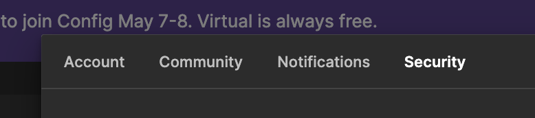

# Cursor에 Figma MCP 설정 방법

## I. Figma 설정

Figma 액세스 토큰을 생성하기 위해 다음 단계를 따르세요:

### 1. Figma 설정 접근


Figma 화면 우측 상단의 프로필 아이콘을 클릭하고 드롭다운 메뉴에서 "Settings"를 선택하세요.

### 2. 계정 보안 설정으로 이동


설정 메뉴에서 "Account" 탭을 클릭하고 아래로 스크롤하여 "Security" 섹션을 찾으세요.

### 3. 액세스 토큰 생성


1. "Access tokens" 섹션에서 "Generate new token" 버튼을 클릭하세요
2. 토큰의 용도를 기억할 수 있는 이름을 지정하세요 (예: "MCP Integration")
3. "Generate token" 버튼을 클릭하세요
4. 생성된 액세스 토큰을 즉시 복사하고 안전하게 보관하세요 - 이 토큰은 다시 확인할 수 없습니다!

> ⚠️ **중요 보안 주의사항:**
>
> -   액세스 토큰을 안전하게 보관하고 절대 공개하지 마세요
> -   토큰이 유출된 것으로 의심되면 즉시 해당 토큰을 폐기하고 새로운 토큰을 생성하세요
> -   토큰은 환경 변수나 보안 설정 파일에 저장하고, 절대 코드에 직접 포함시키지 마세요

## II. MCP 설정

Figma 액세스 토큰을 생성한 후, 다음 단계에 따라 MCP 통합을 설정하세요:

### 1. Smithery.ai 플랫폼 접속

[https://smithery.ai](https://smithery.ai)에 접속하여 계정에 로그인하고 MCP 서버 설정을 시작하세요.

### 2. Figma MCP 서버 검색


1. "Add Server" 섹션으로 이동하세요
2. 검색창에 "Figma API Integration" (@ai-zerolab/mcp-figma)을 입력하세요
3. 검색 결과에서 Figma MCP 서버를 찾으세요

### 3. 설치 환경 선택


1. Figma MCP 서버를 찾은 후, 설치 환경을 선택해야 합니다
2. "Cursor"를 설치 환경으로 선택하세요

### 4. 설치 명령어 생성


1. 입력창에 이전에 생성한 Figma 액세스 토큰을 이 필드에 붙여넣으세요
2. Connect 버튼을 클릭하면 설치 명령어가 생성됩니다

### 5. MCP 클라이언트 설치


2. 제공된 명령어를 복사하세요 - 이는 Figma MCP 서버를 초기화하는 데 사용됩니다
3. 터미널이나 개발 환경에서 이 명령어를 실행하세요
4. 연결이 성공적으로 이루어졌는지 확인하세요

이제 Figma MCP 서버를 애플리케이션에서 사용할 준비가 완료되었습니다! MCP 서버 통합을 통해 워크플로우 자동화와 디자인 시스템 관리를 위한 Figma API 기능을 사용할 수 있습니다.

## III. 코드 생성

MCP 통합 설정을 완료한 후, Figma 컴포넌트에서 코드를 생성할 수 있습니다. 방법은 다음과 같습니다:

### 1. Figma 컴포넌트 URL 복사


1. Figma 디자인 파일을 엽니다
2. 코드로 생성하고 싶은 컴포넌트를 우클릭합니다
3. 컨텍스트 메뉴에서 "Copy/Paste"를 선택합니다
4. "Copy link"를 선택하여 컴포넌트의 URL을 복사합니다
5. 복사된 URL은 다음과 같은 형식을 가집니다: `https://www.figma.com/file/[FILE_ID]/[FILE_NAME]?type=design&node-id=[NODE_ID]&mode=design`

### 2. 생성 프롬프트 작성

Figma 컴포넌트에서 코드를 생성하기 위해서는 다음 내용을 포함한 프롬프트를 작성해야 합니다:

1. 복사한 컴포넌트 URL
2. 코드 생성을 위한 구체적인 요구사항:
    - 대상 프레임워크 (React, Vue 등)
    - 스타일링 방식 (CSS, Tailwind 등)
    - 반응형 디자인 요구사항
    - 접근성 요구사항
    - 필요한 특정 기능

프롬프트 예시 형식:

```
다음 Figma 컴포넌트의 [프레임워크] 코드를 생성해주세요: [컴포넌트_URL]
다음 사항들이 필요합니다:
- [스타일링 방식] 사용
- [화면 크기]에 대한 반응형 지원
- [특정 기능/요구사항] 포함
- [접근성 표준] 준수
```

> 💡 **더 나은 결과를 위한 팁:**
>
> -   기술적 요구사항을 구체적으로 명시하세요
> -   의존성이나 제약사항을 언급하세요
> -   필요한 특정 기능이나 동작을 명시하세요
> -   접근성 요구사항을 포함하세요
> -   생성된 코드에 문서화나 주석이 필요한지 언급하세요
