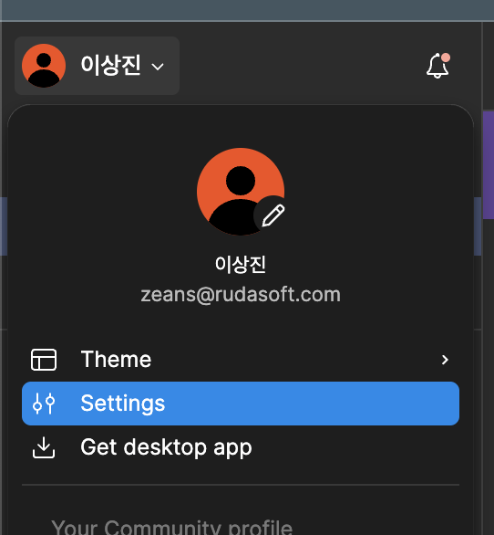
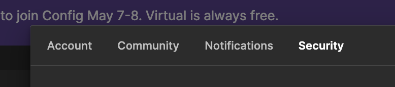

# Cách Cài Đặt Figma MCP trong Cursor

## I. Cài Đặt Figma

Làm theo các bước sau để tạo token truy cập Figma:

### 1. Truy Cập Cài Đặt Figma


Nhấp vào biểu tượng hồ sơ ở góc trên bên phải của Figma và chọn "Settings" từ menu thả xuống.

### 2. Điều Hướng đến Bảo Mật Tài Khoản


Trong menu cài đặt, nhấp vào tab "Account" và cuộn xuống để tìm phần "Security".

### 3. Tạo Token Truy Cập


1. Trong phần "Access tokens", nhấp vào nút "Generate new token"
2. Đặt tên token để dễ nhớ mục đích sử dụng (ví dụ: "MCP Integration")
3. Nhấp vào "Generate token"
4. Sao chép token truy cập ngay lập tức và lưu trữ an toàn - bạn sẽ không thể xem lại token này!

> ⚠️ **Lưu Ý Bảo Mật Quan Trọng:**
>
> -   Giữ token truy cập an toàn và không bao giờ chia sẻ công khai
> -   Nếu nghi ngờ token bị lộ, hãy thu hồi ngay lập tức và tạo token mới
> -   Lưu trữ token trong biến môi trường hoặc tệp cấu hình bảo mật, không bao giờ trực tiếp trong mã

## II. Cài Đặt MCP

Sau khi tạo token truy cập Figma, làm theo các bước sau để thiết lập tích hợp MCP:

### 1. Truy Cập Nền Tảng Smithery.ai

Truy cập [https://smithery.ai](https://smithery.ai) và đăng nhập vào tài khoản của bạn để bắt đầu thiết lập máy chủ MCP.

### 2. Tìm Kiếm Máy Chủ Figma MCP


1. Điều hướng đến phần "Add Server"
2. Tìm kiếm "Figma API Integration" (@ai-zerolab/mcp-figma) trong thanh tìm kiếm
3. Tìm máy chủ Figma MCP trong kết quả tìm kiếm

### 3. Chọn Môi Trường Cài Đặt


1. Sau khi tìm thấy máy chủ Figma MCP, bạn cần chọn môi trường cài đặt
2. Chọn "Cursor" làm môi trường cài đặt

### 4. Tạo Lệnh Cài Đặt


1. Dán token truy cập Figma đã tạo trước đó vào trường nhập liệu
2. Nhấp vào nút Connect để tạo lệnh cài đặt

### 5. Cài Đặt MCP Client


2. Sao chép lệnh được cung cấp - lệnh này sẽ được sử dụng để khởi tạo máy chủ Figma MCP
3. Thực thi lệnh này trong terminal hoặc môi trường phát triển của bạn
4. Xác minh kết nối đã thành công

Máy chủ Figma MCP của bạn đã sẵn sàng để sử dụng với các ứng dụng! Bạn có thể sử dụng các tính năng API Figma thông qua tích hợp máy chủ MCP để tự động hóa quy trình làm việc và quản lý hệ thống thiết kế.

## III. Tạo Mã

Sau khi thiết lập tích hợp MCP, bạn có thể bắt đầu tạo mã từ các component Figma. Đây là cách thực hiện:

### 1. Sao Chép URL Component Figma


1. Mở tệp thiết kế Figma của bạn
2. Nhấp chuột phải vào component bạn muốn tạo mã
3. Chọn "Copy/Paste" từ menu ngữ cảnh
4. Chọn "Copy link" để lấy URL của component
5. URL đã sao chép sẽ có dạng: `https://www.figma.com/file/[FILE_ID]/[FILE_NAME]?type=design&node-id=[NODE_ID]&mode=design`

### 2. Viết Prompt Tạo Mã

Để tạo mã từ component Figma, bạn cần viết prompt bao gồm:

1. URL component đã sao chép
2. Yêu cầu cụ thể cho việc tạo mã:
    - Framework mục tiêu (React, Vue, v.v.)
    - Phương pháp tạo kiểu (CSS, Tailwind, v.v.)
    - Yêu cầu thiết kế responsive
    - Yêu cầu về khả năng truy cập
    - Các chức năng cụ thể cần thiết

Ví dụ về định dạng prompt:

```
Vui lòng tạo mã [framework] cho component Figma này: [COMPONENT_URL]
Tôi cần:
- Sử dụng [phương pháp tạo kiểu]
- Responsive cho [kích thước màn hình]
- Bao gồm [tính năng/yêu cầu cụ thể]
- Tuân thủ [tiêu chuẩn khả năng truy cập]
```

> 💡 **Mẹo để Có Kết Quả Tốt Hơn:**
>
> -   Nêu rõ các yêu cầu kỹ thuật
> -   Đề cập đến các phụ thuộc hoặc ràng buộc
> -   Chỉ định nếu bạn cần các tính năng hoặc hành vi cụ thể
> -   Bao gồm các yêu cầu về khả năng truy cập
> -   Đề cập nếu bạn cần tài liệu hoặc chú thích trong mã được tạo
