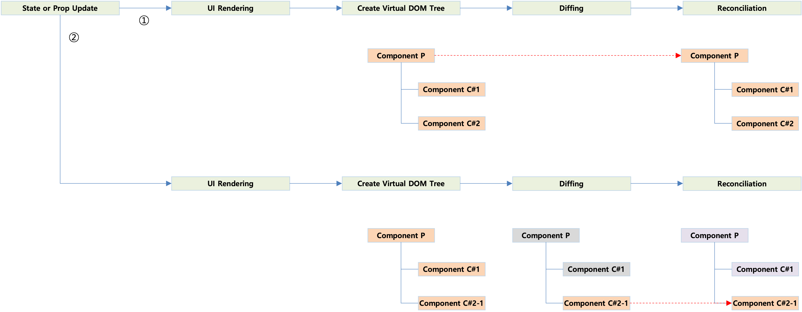

# 1. React Virtual DOM

- Thao tác DOM (Document Object Model) tốn kém, có thể gây ảnh hưởng tiêu cực đến hiệu suất khi có nhiều thay đổi trên trang web
- Một trong những tính năng chính của React, là một khái niệm trừu tượng hóa lập trình cho DOM thực sự của trình duyệt
- Virtual DOM là bản sao nhẹ của DOM thực sự
- So sánh (Diffing) Virtual DOM trước và sau khi thay đổi trạng thái, sau đó cập nhật DOM thực sự

# 2. Quá trình cập nhật UI

- Cập nhật State hoặc Prop
- Hiển thị UI
- Tạo cây Virtual DOM
- So sánh (Diffing) Virtual DOM trước và sau khi thay đổi trạng thái
- Cập nhật DOM thực sự dựa trên Virtual DOM đã thay đổi (Reconciliation)

  
